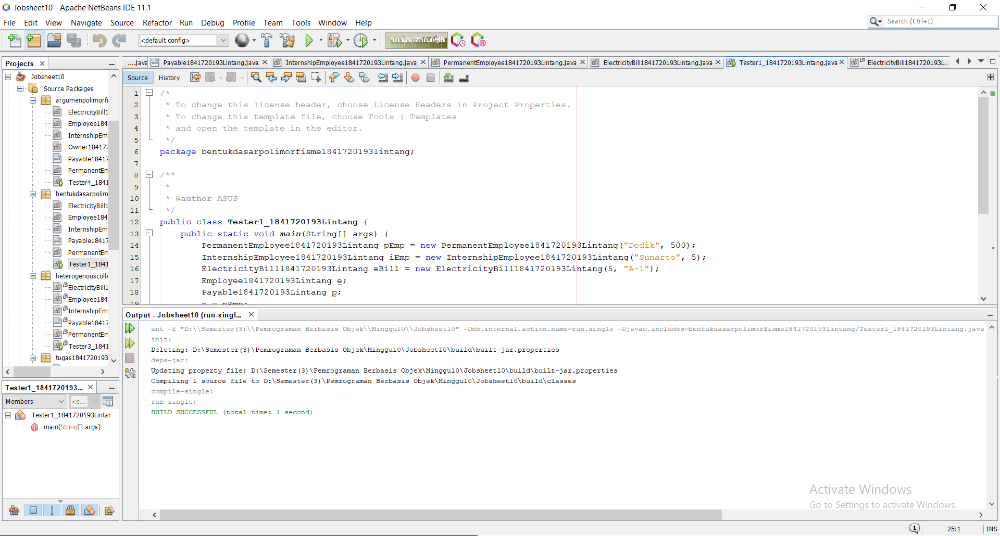

# Laporan Praktikum #10 -  10_Polimorfisme

Polimorfisme

## Kompetensi
   
Setelah melakukan percobaan pada jobsheet ini, diharapkan mahasiswa mampu: 
a. Memahami konsep dan bentuk dasar polimorfisme 
b. Memahami konsep virtual method invication 
c. Menerapkan polimorfisme pada pembuatan heterogeneous collection 
d. Menerapkan polimorfisme pada parameter/argument method 
e. Menerapkan object casting untuk meng-ubah bentuk objek 

## Ringkasan Materi

1. Pendahuluan 
Polimorfisme merupakan kemampuan suatu objek untuk memiliki banyak bentuk. Penggunaan polimorfisme yang paling umum dalam OOP terjadi ketika ada referensi super class yang digunakan untuk merujuk ke objek dari sub class. Dengan kata lain, ketika ada suatu objek yang dideklarasikan dari super class, maka objek tersebut bisa diinstansiasi sebagai objek dari sub class. Dari uraian tersebut bisa dilihat bahwa konsep polimorfisme bisa diterapkan pada class-class yang memiliki relasi inheritance (relasi generalisasi atau IS-A). 
Selain pada class-class yang memiliki relasi inheritance, polimorfisme juga bisa diterapkan pada interface. Ketika ada objek yang dideklarasikan dari suatu interface, maka ia bisa digunakan untuk mereferensi ke objek dari class-class yang implements ke interface tersebut. 
Untuk mengilustrasikan uraian di atas, diberikan contoh sebagai berikut ini. Terdapat interface Vegetarian, dan super class Animal. Kemudian dibuat class Deer yang merupakan sub-class dari Animal dan implements ke Vegetarian. Sedangkan class Lion sub-class dari Animal, dan tidak implements ke Vegetarian.  
public interface Vegetarian{}  public class Animal{}  
public class Deer extends Animal implements Vegetarian{} public class Lion extends Animal {} 
Dari deklarai class di atas, contoh deklarasi objek di bawah ini akan menunjukan mana yang valid dan yang tidak valid berdasarkan konsep polimorfisme.  
Deer d = new Deer(); 
Lion l = new Lion(); 
 
	Animal a = d; 	valid	   
Animal a2 = l; 
Vegetarian v = d;  
Vegetarian v2 = l; 
tidak	   valid	   
 
Dari contoh di atas, a (bertipe Animal) bisa digunakan untuk mereferensi ke objek d (merupakan objek dari Deer), karena class Deer merupakan turunan dari Animal. Demikian juga a2 (bertipe Animal), juga bisa digunakan untuk mereferensi ke objek l (merupakan objek dari Lion), karena class Lion merupakan turunan dari Animal. Objek v (dideklarasikan dari interface Vegetarian) bisa juga digunakan untuk mereferensi ke objek d (objek dari class Deer), hal ini bisa dilakukan karena class Deer implements ke interface 
Vegetarian. 
Sedangkan objek v2 (didekarasikan dari interface Vegetarian) tidak bisa digunakan untuk mereferensi objek l (objek dari class Lion), karena class 
Lion tidak implements ke interface Vegetarian. 
Ilustrasi tersebut bisa menunjuan konsep dan bentuk dasar dari polimorfisme. 
 
Virtual method Invocation 
Virtual method invocation terjadi ketika ada pemanggilan overriding method dari suatu objek polimorfisme. Disebut virtual karena antara method yang dikenali oleh compiler dan method yang dijalankan oleh JVM berbeda.  
 	public class Animal{  	public void walk(){ 
System.out.println(“The animal is walking 
around the jungle”); 
} 
}  
public class Deer extends Animal { 
	 	@override 
public void walk(){ 
System.out.println(“The deer is walking around the jungle”); 
} 
} 
Ketika ada suatu objek polimorfisme a, misalkan: 
 	Deer d = new Deer(); 
 	Animal a = d; 
Kemudian dipanggil method overriding darinya, maka saat itu terjadi pemanggilan method virtual, seperti: 
 	a.walk(); 
Saat compile time, compiler akan mengenali method walk() yang akan dipanggil adalah method walk() yang ada di class Animal, karena objek a bertipe Animal. Tetapi saat dijalankan (run time), maka yang dijalankan oleh JVM justru method walk() yang ada di class Deer. Akan berbeda halnya jika pemanggilan method walk() dilakukan dari objek d (bukan objek polimorfisme), seperti  
 	d.walk(); 
maka method walk() yang dikenali saat compile time oleh compiler dan yang dijalankan saat runtime oleh JVM adalah sama-sama method walk() yang ada di class Deer (karena objek d dideklarasikan dari class Deer). 
 
Heterogeneous Collection 
Dengan adanya konsep polimorfisme, maka variabel array bisa dibuat heterogen. Artinya di dalam array tersebut bisa berisi berbagai macam objek yang berbeda. Contoh: 
 	Animal arr[] = new Animal[2];  	arr[0] = new Deer();  	arr[1] = new Lion(); 
 
Dari contoh tersebut data pertama dari array arr berisi objek Deer, dan data kedua dari arr berisi objek Lion. Hal ini bisa dilakukan karena array arr dideklarasikan dari class Animal (superclass dari Deer dan Lion). 
 
Polymorphic Argument 
Polimorfisme juga bisa diterapkan pada argument suatu method. Tujuannya agar method tersebut bisa menerima nilai argument dari berbagai bentuk objek. Misalkan dibuat class baru sebagai berikut: 
 	public class Human{  	public void drive(Animal anim){ 
anim.walk(); 
} 
} 
Perhatikan method drive(), ia memiliki argument berupa Animal. Karena Animal memiliki subclass Lion dan Deer, maka method drive() tersebut akan bisa menerima argument berupa objek dari Deer maupun objek dari 
Lion. 
 	Deer d = new Deer(); 
 	Lion l = new Lion();  	Human hum = new Human();  	hum.drive(d);  	hum.drive(l); 
 
Operator instanceof 
Operator instanceof bisa digunakan untuk mengecek apakah suatu objek merupakan hasil instansiasi dari suatu class tertentu. Hasil dari instanceof berupa nilai boolean. Misalkan dibuat objek d dan l. 
 	Deer d = new Deer(); 
 	Lion l = new Lion(); 
 	Animal a1 = d;  	Animal a2 = l; 
Jika kemudian digunakan operator instanceof, misalkan 
 	a1 instanceof Deer   akan menghasilkan true 
 	a2 instanceof Lion  akan menghasilkan false 	 
 
Object Casting 
Casting objek digunakan untuk mengubah tipe dari suatu objek. Jika ada suatu objek dari subclass kemudian tipenya diubah ke superclass, maka hal ini termasuk ke upcasting. Contoh: 
 	Deer d = new Deer(); 
 	Animal a1 = d; // proses ini bisa disebut juga upcasting 
 
Downcast  terjadi jika ada suatu objek superclass, kemudian diubah menjadi objek dari subclass. Contoh: 
 	Deer d = new Deer(); 
 	Animal a1 = d; // proses ini bisa disebut juga upcasting 
 	Deer d = (Deer) a1; //proses downcasting 
 
 Proses downcasting sering disebut juga sebagai explicit casting, karena bentuk tujuan dari casting harus dituliskan dalam tanda kurung, di depan objek yang akan di-casting 
 
2. Studi Kasus 
Untuk percobaan pada joobsheet ini akan digunakan class diagram di bawah ini: 
  
Dalam suatu perusahaan, pemilik pada tiap bulannya harus membayar gaji pegawai tetap dan rekening listrik. Selain pegawai tetap perusahaan juga memiliki pegawai magang, dimana pegawai ini tidak mendapatkan gaji.  

## Praktikum

### Percobaan 1 Bentuk dasar polimorfisme 
 
1. Buat class Employee

2. Buat interface Payable 
  
3. Buat class InternshipEmployee, subclass dari Employee 
 
4. Buat class PermanentEmployee, subclass dari Employee dan implements ke Payable 
 
5. Buat class ElectricityBill yang implements ke interface 
Payable  

1. Ketikkan kode class Employee dibawah ini. 

link kode program : [ini link ke kode program](../../src\10_Polimorfisme\bentukdasarpolimorfisme1841720193lintang\Employee1841720193Lintang.java)

2. Ketikkan kode class Payable dibawah ini. 

link kode program : [ini link ke kode program](../../src\10_Polimorfisme\bentukdasarpolimorfisme1841720193lintang\Payable1841720193Lintang.java)

3. Ketikkan kode class InternshipEmployee dibawah ini. 

link kode program : [ini link ke kode program](../../src\10_Polimorfisme\bentukdasarpolimorfisme1841720193lintang\InternshipEmployee1841720193Lintang.java)

4. Ketikkan kode class PermanentEmployee dibawah ini. 

link kode program : [ini link ke kode program](../../src\10_Polimorfisme\bentukdasarpolimorfisme1841720193lintang\PermanentEmployee1841720193Lintang.java)

5. Ketikkan kode class ElectricityBill dibawah ini. 

link kode program : [ini link ke kode program](../../src\10_Polimorfisme\bentukdasarpolimorfisme1841720193lintang\ElectricityBill1841720193Lintang.java)

6. Ketikkan kode class Tester1 dibawah ini. 

link kode program : [ini link ke kode program](../../src\10_Polimorfisme\bentukdasarpolimorfisme1841720193lintang\Tester1_1841720193Lintang.java)

7. Ketikkan kode class Hasil1 dibawah ini. 

- Pertanyaan
1. Class apa sajakah yang merupakan turunan dari class Employee?
Jawab : Class IntershipEmployee dan Class PermanentEmployee. 

2. Class apa sajakah yang implements ke interface Payable? 
Jawab : Class PermanentEmployee dan ElectricityBill. 

3. Perhatikan class Tester1, baris ke-10 dan 11. Mengapa e, bisa diisi dengan objek pEmp (merupakan objek dari class 
PermanentEmployee) dan objek iEmp (merupakan objek dari class 
InternshipEmploye) ?  
Jawab : Karena merupakan turunan dari class Employee dimana class Employee diinstasiasi dengan objek e. 

4. Perhatikan class Tester1, baris ke-12 dan 13. Mengapa p, bisa diisi dengan objek pEmp (merupakan objek dari class 
PermanentEmployee) dan objek eBill (merupakan objek dari class 
ElectricityBill) ? 
Jawab : Karena class PermanentEmployee dan ElectricityBill mengimplentasi interface dari class Payable. 

5. Coba tambahkan sintaks: p = iEmp; 
     e = eBill; 
pada baris 14 dan 15 (baris terakhir dalam method main) ! Apa yang menyebabkan error? 
Jawab : Karena Class PermanentEmployee dan InternshipEmployee merupakan turunan dari Class Payable. 

6. Ambil kesimpulan tentang konsep/bentuk dasar polimorfisme!
Jawab : Polimorfisme bisa diterapkan pada class-class yang memiliki relasi inheritance dan interface. Ketika ada objek yang dideklarasikan dari suatu interface, maka ia bisa digunakan untuk mereferensikan ke objek yang mengimplements class interface tersebut. 

### Percobaan 2 Virtual method invocation  

1. Pada percobaan ini masih akan digunakan class-class dan interface yang digunakan pada percobaan sebelumnya. 

2. Buat class baru dengan nama Tester2.  
 
3. Jalankan class Tester2, dan akan didapatkan hasil sebagai berikut: 

1. Ketikkan kode class Employee dibawah ini. 

link kode program : [ini link ke kode program](../../src\10_Polimorfisme\virtualmethodinvocation1841720193lintang\Employee1841720193Lintang.java)

2. Ketikkan kode class Payable dibawah ini. 

link kode program : [ini link ke kode program](../../src\10_Polimorfisme\virtualmethodinvocation1841720193lintang\Payable1841720193Lintang.java)

3. Ketikkan kode class InternshipEmployee dibawah ini. 

link kode program : [ini link ke kode program](../../src\10_Polimorfisme\virtualmethodinvocation1841720193lintang\InternshipEmployee1841720193Lintang.java)

4. Ketikkan kode class PermanentEmployee dibawah ini. 

link kode program : [ini link ke kode program](../../src\10_Polimorfisme\virtualmethodinvocation1841720193lintang\PermanentEmployee1841720193Lintang.java)

5. Ketikkan kode class ElectricityBill dibawah ini. 

link kode program : [ini link ke kode program](../../src\10_Polimorfisme\virtualmethodinvocation1841720193lintang\ElectricityBill1841720193Lintang.java)

6. Ketikkan kode class Tester2 dibawah ini. 

link kode program : [ini link ke kode program](../../src\10_Polimorfisme\virtualmethodinvocation1841720193lintang\Tester2_1841720193Lintang.java)

7. Ketikkan kode class Hasil2 dibawah ini. 

- Pertanyaan
1. Perhatikan class Tester2 di atas, mengapa pemanggilan e.getEmployeeInfo() pada baris 8 dan pEmp.getEmployeeInfo() pada baris 10 menghasilkan hasil sama?  
Jawab : Karena pada baris ke 7 sudah dideklarasikan bahwa object e merupakan pEmp. 

2. Mengapa pemanggilan method e.getEmployeeInfo() disebut sebagai pemanggilan method virtual (virtual method invication), sedangkan pEmp.getEmployeeInfo() tidak? 
Jawab : karena e merupakan method yang fungsinya untuk passing. 

3. Jadi apakah yang dimaksud dari virtual method invocation? Mengapa disebut virtual? 
Jawab : Virtual method invocation terjadi ketika ada pemanggilan overriding method dari suatu object polimorfisme. Karena antara method yang dikenali oleh compiler dan method yang dijalankan oleh JVM berbeda. 

### Percobaan 3 Heterogenous Collection  

1. Pada percobaan ke-3 ini, masih akan digunakan class-class dan interface pada percobaan sebelumnya. 

2. Buat class baru Tester3.
 
1. Ketikkan kode class Employee dibawah ini. 

link kode program : [ini link ke kode program](../../src\10_Polimorfisme\heterogenouscollection1841720193lintang\Employee1841720193Lintang.java)

2. Ketikkan kode class Payable dibawah ini. 

link kode program : [ini link ke kode program](../../src\10_Polimorfisme\heterogenouscollection1841720193lintang\Payable1841720193Lintang.java)

3. Ketikkan kode class InternshipEmployee dibawah ini. 

link kode program : [ini link ke kode program](../../src\10_Polimorfisme\heterogenouscollection1841720193lintang\InternshipEmployee1841720193Lintang.java)

4. Ketikkan kode class PermanentEmployee dibawah ini. 

link kode program : [ini link ke kode program](../../src\10_Polimorfisme\heterogenouscollection1841720193lintang\PermanentEmployee1841720193Lintang.java)

5. Ketikkan kode class ElectricityBill dibawah ini. 

link kode program : [ini link ke kode program](../../src\10_Polimorfisme\heterogenouscollection1841720193lintang\ElectricityBill1841720193Lintang.java)

6. Ketikkan kode class Tester3 dibawah ini. 

link kode program : [ini link ke kode program](../../src\10_Polimorfisme\heterogenouscollection1841720193lintang\Tester3_1841720193Lintang.java)

7. Ketikkan kode class Hasil3 dibawah ini. 

- Pertanyaan 
1. Perhatikan array e pada baris ke-8, mengapa ia bisa diisi dengan objek-objek dengan tipe yang berbeda, yaitu objek pEmp (objek dari PermanentEmployee) 	dan objek iEmp (objek dari  InternshipEmployee) ? 
Jawab : karena objek pEmp dan iEmp merupakan object dari class yang merupakan turunan dari class Employee. 

2. Perhatikan juga baris ke-9, mengapa array p juga biisi dengan objekobjek dengan tipe yang berbeda, yaitu objek pEmp (objek dari PermanentEmployee) dan objek eBill (objek dari 
ElectricityBilling) ? 
Jawab : Karena objek pEmp dan eBill merupakan object dari class yang mengimplements dari class Payable. 

3. Perhatikan baris ke-10, mengapa terjadi error? 
Jawab : Karena eBill bukan termasuk Class turunan dari Class Employee. 

### Percobaan 4 Argumen polimorfisme, instanceod dan casting objek

1. Percobaan 4 ini juga masih menggunakan class-class dan interface yang digunakan pada percobaan sebelumnya. 

2. Buat class baru dengan nama Owner. Owner bisa melakukan pembayaran baik kepada pegawai permanen maupun rekening listrik melalui method pay(). Selain itu juga bisa menampilkan info pegawai permanen maupun pegawai magang melalui method showMyEmployee().

3. Buat class baru Tester4.

4. Jalankan class Tester4, dan akan didapatkan hasil sebagai berikut:
 
1. Ketikkan kode class Employee dibawah ini. 

link kode program : [ini link ke kode program](../../src\10_Polimorfisme\argumenpolimorfismeinstanceodcastingobjek1841720193lintang\Employee1841720193Lintang.java)

2. Ketikkan kode class Payable dibawah ini. 

link kode program : [ini link ke kode program](../../src\10_Polimorfisme\argumenpolimorfismeinstanceodcastingobjek1841720193lintang\Payable1841720193Lintang.java)

3. Ketikkan kode class InternshipEmployee dibawah ini. 

link kode program : [ini link ke kode program](../../src\10_Polimorfisme\argumenpolimorfismeinstanceodcastingobjek1841720193lintang\InternshipEmployee1841720193Lintang.java)

4. Ketikkan kode class PermanentEmployee dibawah ini. 

link kode program : [ini link ke kode program](../../src\10_Polimorfisme\argumenpolimorfismeinstanceodcastingobjek1841720193lintang\PermanentEmployee1841720193Lintang.java)

5. Ketikkan kode class ElectricityBill dibawah ini. 

link kode program : [ini link ke kode program](../../src\10_Polimorfisme\argumenpolimorfismeinstanceodcastingobjek1841720193lintang\ElectricityBill1841720193Lintang.java)

6. Ketikkan kode class Owner dibawah ini. 

link kode program : [ini link ke kode program](../../src\10_Polimorfisme\argumenpolimorfismeinstanceodcastingobjek1841720193lintang\owner1841720193Lintang.java)

7. Ketikkan kode class Tester4 dibawah ini. 

link kode program : [ini link ke kode program](../../src\10_Polimorfisme\argumenpolimorfismeinstanceodcastingobjek1841720193lintang\Tester4_1841720193Lintang.java)

8. Ketikkan kode class Hasil4 dibawah ini. 

- Pertanyaan 
1.	Perhatikan class Tester4 baris ke-7 dan baris ke-11, mengapa pemanggilan ow.pay(eBill) dan ow.pay(pEmp) bisa dilakukan, padahal jika diperhatikan method pay() yang ada di dalam class Owner memiliki argument/parameter bertipe Payable? Jika diperhatikan lebih detil eBill merupakan objek dari ElectricityBill 	dan 	pEmp 	merupakan 	objek 	dari 
PermanentEmployee? 
Jawab : Pada class Tester4 baris ke-7 dan baris ke-11, pemanggilan ow.pay(eBill) dan ow.pay(pEmp) bisa dilakukan, padahal jika diperhatikan method pay() yang ada di dalam class Owner memiliki argument/parameter bertipe Payable karena keduanya sama - sama mengimplementasikan interface Payable. 

2.	Jadi apakah tujuan membuat argument bertipe Payable pada method pay() yang ada di dalam class Owner? 
Jawab : Tujuan membuat argument bertipe Payable pada method pay() yang ada di dalam class Owner untuk bisa memanggil method getPaymentAmount yang ada di masing – masing object yang dimasukkan sebagai parameter. 

3.	Coba pada baris terakhir method main() yang ada di dalam class 
Tester4 ditambahkan perintah ow.pay(iEmp);Mengapa terjadi error?  
Jawab : Eror karena iEmp tidak mengimplements class Payable. 

4.	Perhatikan class Owner, diperlukan untuk apakah sintaks p instanceof ElectricityBill pada baris ke-6 ? 
Jawab : Untuk mengecek apakah object yang dimasukkan sebagai implements dari Payable atau tidak. 

5.	Perhatikan kembali class Owner baris ke-7, untuk apakah casting objek disana (ElectricityBill eb = (ElectricityBill) p) diperlukan ? Mengapa objek p yang bertipe Payable harus di-casting ke dalam objek eb yang bertipe ElectricityBill ? 
Jawab : Untuk dikembalikan ke instan sesungguhnya sehingga dapat memanggil method getBillInfo() yang hanya ada di class ElectricityBill. 

### Tugas

Dalam suatu permainan, Zombie dan Barrier bisa dihancurkan oleh Plant dan bisa menyembuhkan diri. Terdapat dua jenis Zombie, yaitu Walking Zombie dan Jumping Zombie. Kedua Zombie tersebut memiliki cara penyembuhan yang berbeda, demikian juga cara penghancurannya, yaitu ditentukan oleh aturan berikut ini: 
•	Pada WalkingZombie o Penyembuhan : Penyembuhan ditentukan berdasar level zombie yang bersangkutan 
 Jika zombie level 1, maka setiap kali penyembuhan, health akan bertambah 20% 
 Jika zombie level 2, maka setiap kali penyembuhan, health akan bertambah 30%  
 Jika zombie level 3, maka setiap kali penyembuhan, health akan bertambah 40% 
o	Penghancuran : setiap kali penghancuran, health akan berkurang 2% 
•	Pada Jumping Zombie o Penyembuhan : Penyembuhan ditentukan berdasar level zombie yang bersangkutan 
 Jika zombie level 1, maka setiap kali penyembuhan, health akan bertambah 30% 
 Jika zombie level 2, maka setiap kali penyembuhan, health akan bertambah 40%  
 Jika zombie level 3, maka setiap kali penyembuhan, health akan bertambah 50% 
o	Penghancuran : setiap kali penghancuran, health akan berkurang 1% 
Buat program dari class diagram di bawah ini! 

1. Ketikkan kode class Barrier dibawah ini. 

link kode program : [ini link ke kode program](../../src\10_Polimorfisme\tugas1841720193lintang\Barrier1841720193Lintang.java)

2. Ketikkan kode class Destroyable dibawah ini. 

link kode program : [ini link ke kode program](../../src\10_Polimorfisme\tugas1841720193lintang\Destroyable1841720193Lintang.java)

3. Ketikkan kode class Jumping Zombie dibawah ini. 

link kode program : [ini link ke kode program](../../src\10_Polimorfisme\tugas1841720193lintang\JumpingZombie1841720193Lintang.java)

4. Ketikkan kode class Plant dibawah ini. 

link kode program : [ini link ke kode program](../../src\10_Polimorfisme\tugas1841720193lintang\Plant1841720193Lintang.java)

5. Ketikkan kode class Walking Zombie dibawah ini. 

link kode program : [ini link ke kode program](../../src\10_Polimorfisme\tugas1841720193lintang\WalkingZombie1841720193Lintang.java)

6. Ketikkan kode class Zombie dibawah ini. 

link kode program : [ini link ke kode program](../../src\10_Polimorfisme\tugas1841720193lintang\Zombie1841720193Lintang.java)

7. Ketikkan kode class Tester Tugas dibawah ini. 

link kode program : [ini link ke kode program](../../src\10_Polimorfisme\tugas1841720193lintang\TeaserTugas1841720193Lintang.java)

8. Ketikkan kode class Hasil4 dibawah ini. 

## Kesimpulan

Dari percobaan diatas, telah dipelajari kosep dari Polimorfisme yang merupakan kemampuan suatu objek untuk memiliki banyak bentuk.

## Pernyataan Diri

Saya menyatakan isi tugas, kode program, dan laporan praktikum ini dibuat oleh saya sendiri. Saya tidak melakukan plagiasi, kecurangan, menyalin/menggandakan milik orang lain.

Jika saya melakukan plagiasi, kecurangan, atau melanggar hak kekayaan intelektual, saya siap untuk mendapat sanksi atau hukuman sesuai peraturan perundang-undangan yang berlaku.

Ttd,

***(LINTANG KUSUMA ADJIE)***
