# Laporan Praktikum #11 -  11_GUI (Graphical User Interface) 

GUI (Graphical User Interface) 

## Kompetensi
   
Setelah menyelesaikan lembar kerja ini mahasiswa diharapkan mampu: 
1. Membuat aplikasi Graphical User Interface sederhana dengan bahasa pemrograman java;
2. Mengenal komponen GUI seperti frame, label, textfield, combobox, radiobutton, checkbox, textarea, menu, serta table; 
3. Menambahkan event handling pada aplikasi GUI.  

## Ringkasan Materi

Pada bab-bab sebelumnya interaksi antara user dengan program hanya berbasis console editor dengan tampilan dos yang membosankan, maka agar interaksi antara user dengan program tidak membosankan diperlukanlah sebuah interface yang menghubungkan antara user dengan  program dengan tampilan grafis, interface ini dinamakan dengan GUI(Graphical User Interface). Dalam pemrograman GUI terdapat beberapa bagian yang harus dilakukan yaitu: 
	1. Membuat windows utama  
	2. Menentukan komponen-komponen pendukung program  
	3. Menentukan tata letak layout agar nantinya semua komponen – komponen yang sudah dipersiapkan bisa diaatur sedemikian rupa  
	4. Event Handling dari sebuah aktivitas, seperti penekanan button, check box dan lain-lain Java Swing merupakan bagian dari JFC (Java Foundation Classes) yang menyediakan API untuk menangani hal yang berkaitan dengan GUI bagi program Java.  Kita bisa membedakan komponen Swing dengan komponen AWT, di mana pada umumnya kelas-kelas yang berada dalam komponen Swing diawali dengan huruf J, misal: JButton, JLabel, JTextField, JRadioButton. 

## Praktikum

### Percobaan 1 JFrame HelloGUI
 
Untuk membuat aplikasi Java berbasis GUI, kita butuh sebuah frame atau applet untuk media eksekusi aplikasi GUI. Pada Java sebuah frame dapat diwakili oleh sebuah kelas, yaitu JFrame. Melalui kelas JFrame kita bisa mendesain tampilan Java GUI sesuai kebutuhan. Beberapa method yang penting dan sering dipakai yaitu: 
 
	a. setSize() : menentukan ukuran frame  
	b. setLocation() : menentukan lokasi frame pada bagian pojok kiri atas  
	c. setVisible() : menampilkan frame  
	d. setDefaultCloseOperation() : menentukan operasi ketika frame ditutup  
	e. setLocationRelativeTo() : menentukan lokasi frame relatif terhadap parameter komponen yang diinputkan  
	f. Pack() : menentukan secara otomatis ukuran frame sesuai komponen yang dimasukkan 

1. Buatlah sebuah project baru di NetBeans dengan nama HelloGui 

2. Tambahkan paket Java ke dalam kode program, import javax.swing.*; 

3. Pada program utama main(), tuliskan script code berikut 

1. Ketikkan kode class Hello Gui dibawah ini. 
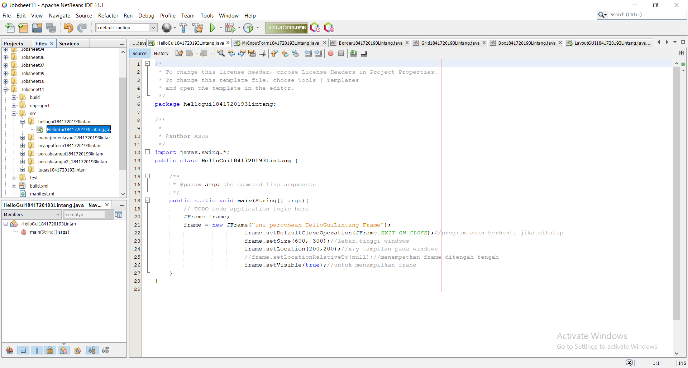
link kode program : [ini link ke kode program](../../src\11_GUI\hellogui1841720193lintang\HelloGui1841720193Lintang.java)

2. Ketikkan kode class Hasil Hello Gui dibawah ini. 
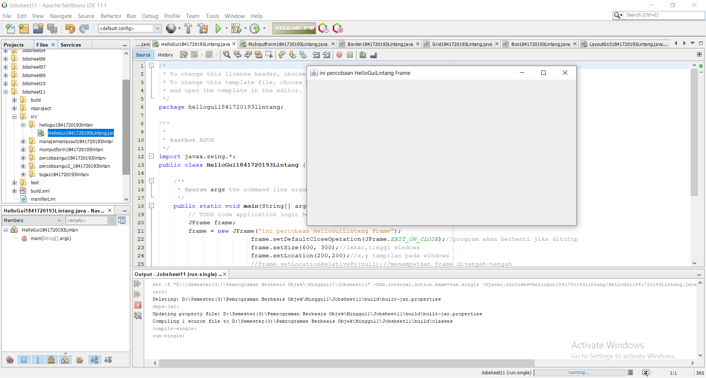

### Percobaan 2 Menangani Input Pada GUI 

Selanjutnya adalah bagaimana memanfaatkan komponen-komponen GUI pada Java untuk menangani inputan, dengan memanfaatkan JFrame, JButton, JLabel, JTextField, JPanel dsb.
 
1. Buatlah project baru dengan nama MyInputForm 2. Pada kelas MyInputForm tambahkan beberapa library berikut 
 
3. Jadikan kelas MyInputForm sebagai turunan dari kelas JFrame 
 
4. Pada kelas MyInputForm tambahkan beberapa variable berikut 
 
5. Buatlah konstruktor dengan nama MyInputForm() dan tambahkan script berikut 
 
6. Buatlah method createTextField() dan tambahkan script berikut untuk menampilkan Text field sebagai inputan maupun output pada window Page 4 of 20 
 
7. Tambahkan method createButton() untuk membuat tampilan button/tombol pada window, dan ketikkan script berikut sebagai event handling  ketika button di klik 
 
8. Selanjtnya, buat method dengan nama createPanel() yang berfungsi untuk membuat panel dengan menambahkan script berikut 
 
9. Langkah berikutnya, pada main program tambahkan script berikut 
Page 5 of 20 
 
10. Compile dan Run program, maka akan tampil hasil/output perkalian nilai A dan Nilai B sebagai berikut 

1. Ketikkan kode class My Input Form dibawah ini. 
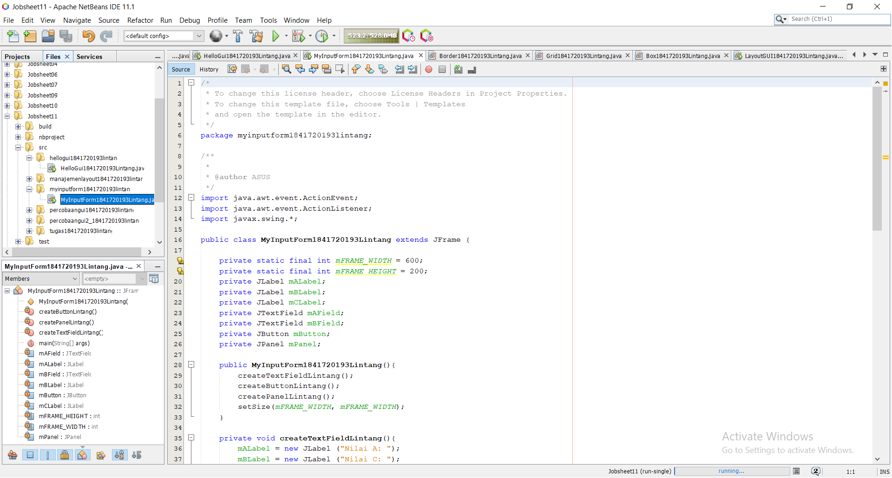
link kode program : [ini link ke kode program](../../src\11_GUI\myinputform1841720193lintang\MyInputForm1841720193Lintang.java)

2. Ketikkan kode class Hasil My Input Form dibawah ini. 
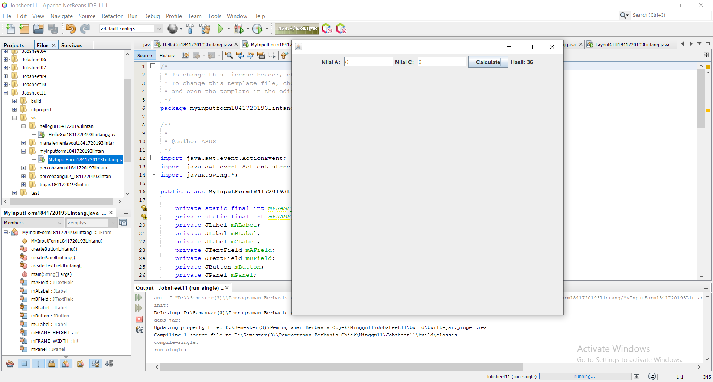

- Pertanyaan
1. Modifikasi kode program dengan menambahkan JButton baru untuk melakukan fungsi perhitungan penambahan, sehingga ketika button di klik (event click) maka akan menampilkan hasil penambahan dari nilai A dan B
Jawab : 

### Percobaan 3 Manajemen Layout 

Java GUI menyediakan beberapa layout yang dapat digunakan pada program. Pada modul praktikum ini akan dijelaskan 3 contoh GUI layout, yaitu:  a) Border layout  b) Grid layout  c) Box layout Sebuah layout border dapat diilustrasikan pada Gambar dibawah, di mana kita dapat meletakkan komponen GUI pada lokasi tertentu misal utara, barat, tengah, timur, dan selatan. Untuk Page 6 of 20 
 
menentukan jenis layout yang akan digunakan, kita dapat memanggil method setLayout() dan selanjutnya memasukkan objek Border Layout. 
 
Langkah-Langkah Praktikum 
 
1. Buatlah project baru dengan nama ManajemenLayout 2. Selanjutnya buatlah 4 kelas dengan nama Border, Box, Grid dan LayoutGUI 
 
3. Pada kelas Border, Grid dan Box tambahkan library yang akan digunakan sebagai berikut 
 
4. Pada setiap kelas Border, Grid dan Box jadikan sebagai kelas turunan dari JFrame 5. Pada kelas Border Ketikkan sript berikut untuk membuat tampilan window dengan meletakkan tombol pada 5 lokasi sebagaimana gambar diatas yaitu (Utara, barat, tengah timur, dan selatan) Page 7 of 20 

6. Selanjutnya, pada kelas Grid ketikkan script berikut untuk membuat layout grid dengan memiliki ukuran 4x2 dan pada masing-masing grid akan diisi dengan tombol 
 
7. Kemudian pada kelas Box, masukkan script berikut untuk membuat tampilan layout dengan bentuk Box Layout dan orientasi Y 
Page 8 of 20 

8. Langkah selanjutnya, diperlukan inisiasi object dari masing-masing layout pada object JFrame. Sehingga Pada kelas LayoutGUI perlu diatur setDefaultCloseOperation() dan setVisible() dengan mengetikkan script berikut, dengan sebelumnya tambahkan library javax.swing.JFrame pada kelas LayoutGUI Page 9 of 20 

9. Compile dan Run program, maka akan tampil 3 hasil/output dari Border Layout, Grid Layout, dan Box Layout sebagai berikut 
 
1. Ketikkan kode class Border dibawah ini. 
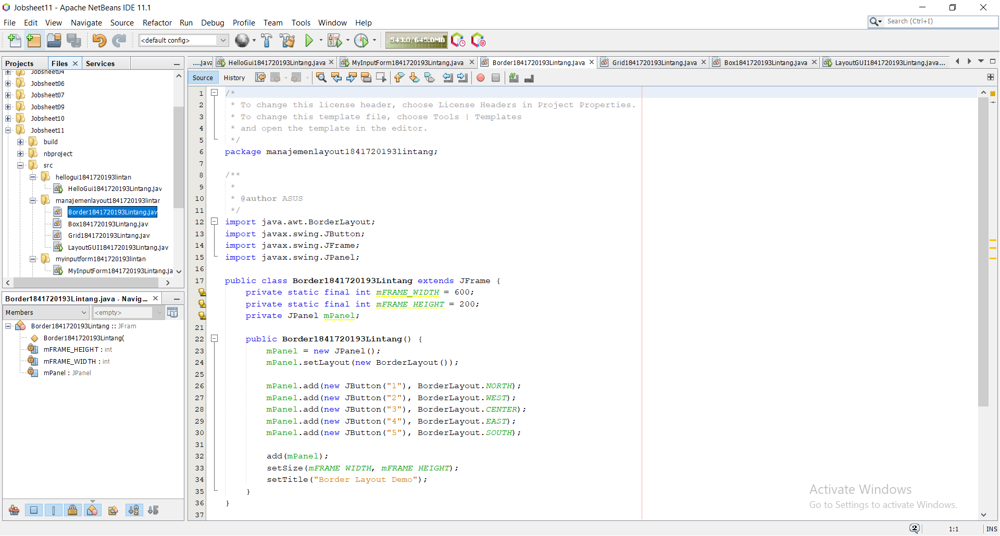
link kode program : [ini link ke kode program](../../src\11_GUI\manajemenlayout1841720193lintang\Border1841720193Lintang.java)

2. Ketikkan kode class Grid dibawah ini. 
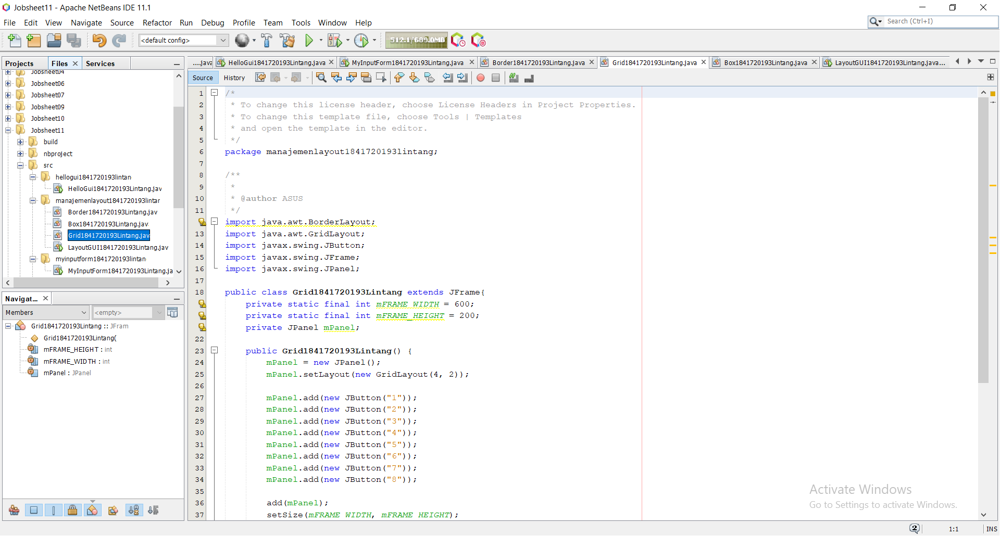
link kode program : [ini link ke kode program](../../src\11_GUI\manajemenlayout1841720193lintang\Grid1841720193Lintang.java)

3. Ketikkan kode class Box dibawah ini. 
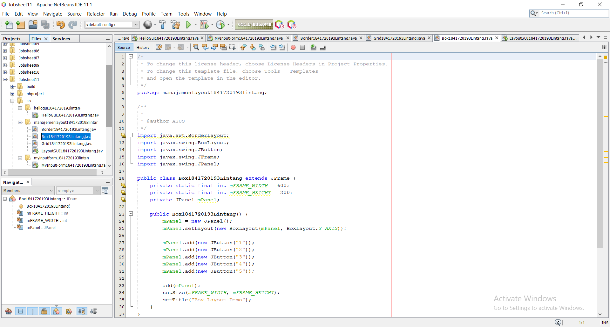
link kode program : [ini link ke kode program](../../src\11_GUI\manajemenlayout1841720193lintang\Box1841720193Lintang.java)

4. Ketikkan kode class Layout GUI dibawah ini. 
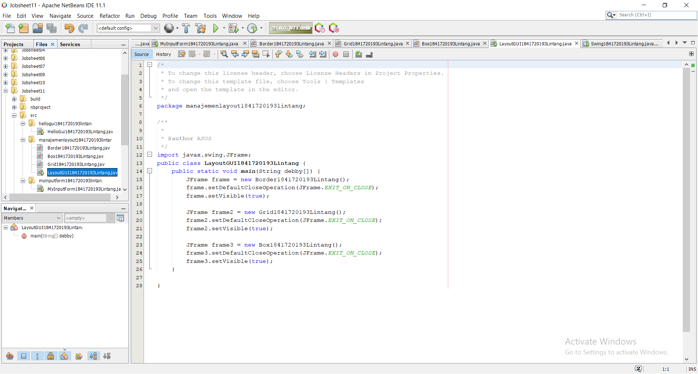
link kode program : [ini link ke kode program](../../src\11_GUI\manajemenlayout1841720193lintang\LayoutGUI1841720193Lintang.java)

5. Ketikkan kode class Hasil Manajemen Layout dibawah ini. 
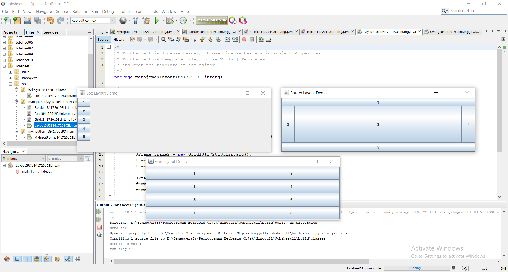 

- Pertanyaan 
1. Apa perbedaan dari Grid Layout, Box Layout dan Border Layout? 
Jawab : Grid menampilkan angka-nya menggunakan tata letak kanan dan kiri, Border menampilkan angkanya sesuai dengan table border yang telah dibuat dan telah diatur, BOX menampilkan angkanya terdapat pada box nya masing masing dan menampilkan angkanya horizontal atau kebawah.

2. Apakah fungsi dari masing-masing kode berikut?
Jawab :  •	menampilkan setiap outputnya dari source code Border, Grid, Box.

### Percobaan 4 Membuat GUI Melalui IDE Netbeans 

1. Buka Netbeans kemudian klik File | New Project sebagaimana pada gambar brikut  
 
2. Dalam New Project wizard, pilih Java Application seperti ditunjukan pada gambar berikut 

3. Pada Project Name field, beri nama project dengan nama PraktikumGUI 
 
4. Klik kanan pada package untuk membuat frame baru, New | JFrame Form seperti pada gambar berikut 
 
5. Selanjutnya setelah muncul jendela new JFrame Form, pada Field Class Name berikan nama Swing, kemudian klik finish 

Selanjutnya akan muncul tampilan window seperti berikut, 
 
6. Langkah selanjutnya denan cara drag & drop, tambahkan komponen-komponen swing yang dibutuhkan dan letakkan pada bagian form 

Buatlah design sebagaimana pada gambar diatas dengan menggunakan komponen Swing berikut: • 2 buah JTextfield • 2 buah JRadioButton • 3 buah JCheckbox • 1 buah JList • 1 buah JComboBox • 1 buah JTextArea • 2 buah JButton • 7 buah JLabel 7. Selanjutnya ubah nama variable dan nama text pada setiap komponen Swing, dengan cara klik kanan | Change Variable Name untuk merubah nama variable serta klik kanan | Edit Text untuk merubah nama text. Sesuaikan variable name dan text name sebagaiman pada gambar berikut 
 
8. Selanjutnya, setelah design selesai pindah ke tab Source kemudian pada kelas Swing tambahkan variable yang dibutuhkan sebagaimana pada script berikut 
 
9. Langkah selanjutnya, kembali ke tab Design dan double klik pada komponen JButton cmdtampil. Maka anda akan masuk pada bagian coding/source code dari cmdtampil kemudian ketikkan script berikut, yang memiliki fungsi untuk memberikan event handling pada JButton cmdtampil saat di klik oleh user 
 
10. Dan pada komponen JButton cmdclear lakukan hal yang sama denan memasukan script berikut 

11. Langkah terakhir, lakukan compile dan run pada project anda, maka program akan tampil seperti gambar berikut dan silahkan isi data anda kemudia klik tampilkan 
 
1. Ketikkan kode class Swing dibawah ini. 
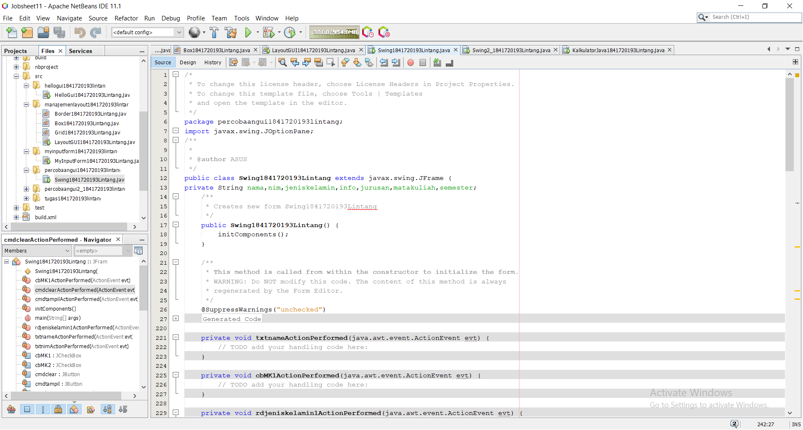
link kode program : [ini link ke kode program](../../src\11_GUI\percobaangui1841720193lintang\Swing1841720193Lintang.java)

2. Ketikkan kode class Swing Design dibawah ini. 
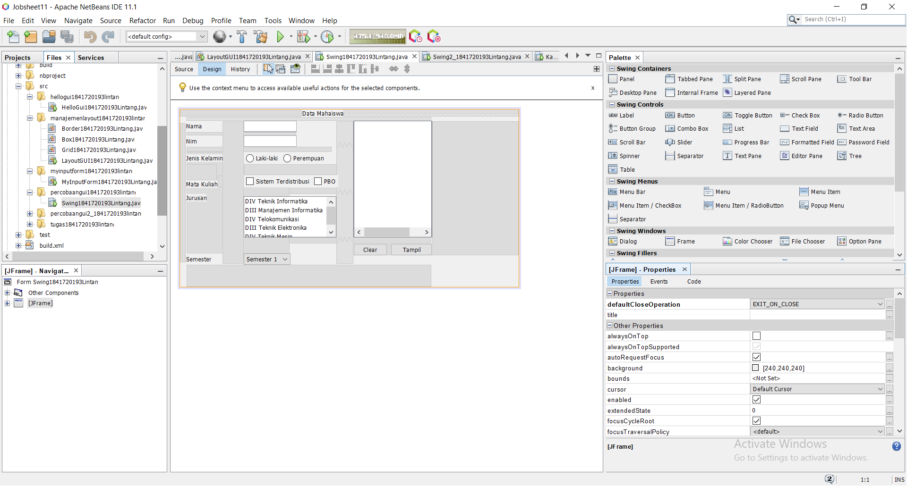

3. Ketikkan kode class Hasil Swing dibawah ini. 
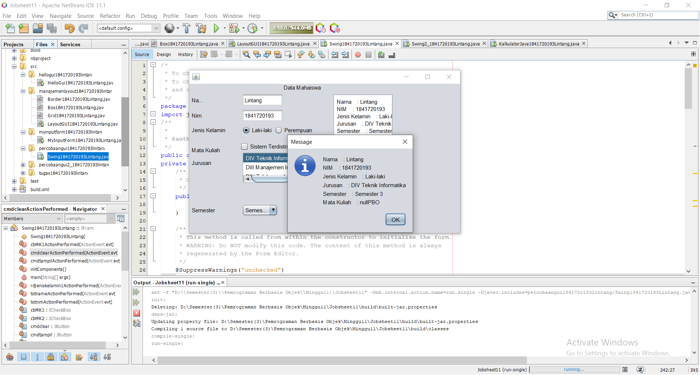

- Pertanyaan 
1. Apakah fungsi dari kode berikut? 
Jawab : Menampilkan dari JFrame form.
 
2. Mengapa pada bagian logika checkbox dan radio button digunakan multiple if ? 
Jawab : Digunakan untuk pengecekkan pada checkbox dicentang atau tidaknya.

3. Lakukan modifikasi pada program untuk melakukan menambahkan inputan berupa alamat dan berikan fungsi pemeriksaan pada nilai Alamat tersebut jika belum diisi dengan menampilkan pesan peringatan?
Jawab : •	if (!txtAlamat.equals("")) {
 alamat = txtAlamat.getText().toString();
3
 }
 jurusan = listJurusan.getSelectedValue().toString();
 semester = comboSemester.getSelectedItem().toString();
 if (alamat.equals("") || alamat.equals(null)) {
 JOptionPane.showMessageDialog(null, "Harap isi kolom alamat");
 } else {
 info = "Nama: " + name + "\n";
 info += "NIM: " + nim + "\n";
 info += "Jenis Kelamin: " + jenisKelamin + "\n";
 info += "Jurusan: " + jurusan + "\n";
 info += "Semster: " + semester + "\n";
 info += "Mata Kuliah: " + mataKuliah + "\n";
 info += "Alamat: " + alamat + "";
 hasil.setText(info);
 JOptionPane.showMessageDialog(null, info);
 }

### Percobaan 5 JTabPane, JTtree, JTable

Lakukan langkah-langkah yang sama dengan membuat new project | java application dan beri nama PercobaanGUI2, buat form baru JFrame Form dan beri nama Swing2 
 
1. Setelah JFrame Form selesai dibuat, Drag & Drop komponen swing JTabPane dari Palette ke bagian form 
Page 17 of 20 
 
2. Selanjutnya, Drag & Drop Panel kedalam JTabPane yang telah dibuat, maka akan terbentuk tam baru di dalam JTabPane. Lakukan dengan cara yang sama, drag & drop panel hingga JTabPane memiliki 3 Tab sebagaimana pada gambar berikut 
 
3. Kemudian anda dapat mengedit Text pada Tab tersebut dengan cara klik kanan pada tab tersebut dan pilih Edit Text. Ubahlah nama tab menjadi Halaman1 , Halaman 2 dan Halaman 3 

4. Pada tab halaman 1 tambahkan komponen JLabel dan edit text menjadi Halaman pertama untuk menandai tab Halaman 1.  

5. Lakukan hal yang sama pada halaman2 dengan menambahkan komponen JTabel dengan cara darg & drop Jtabel ke tab Halaman 2 

6. Pada tab halaman 3 tambahkan komponen JTree dengan cara drag & drop, sehingga tampilan pada tab Halaman 3 

7. Kemudian klik kanan pada JTree dan pilih Property selanjutnya pada bagian Model klik titiktitik pada bagian kanan model, Maka akan muncul jendela baru dan hapus semua item di kolom sebelah kiri sebagaimana pada gambar berikut 

8. Langkah selanjutna, pada tab halaman 3 tambahkan 1 buah JTextField dan 1 buah JButton sehinnga tampilan akan menjadi seperti berikut 

9. Selanjutnya, double klik pada Jbutton cmdtambah. Maka anda akan masuk pada bagian coding / source code, kemudain tambahkan script berikut  
 
10. Langkah terakhir, lakukan compile dan run pada project anda, maka program akan tampil seperti gambar berikut
 
11. Pilih tab Halaman 3 dan Klik pada Jtree root. Dan ketikan Bapak pada JTextField kemudian klik Tambah. Maka Jtree akan bertambah seperti pada gambar berikut 

1. Ketikkan kode class Swing 2 dibawah ini. 
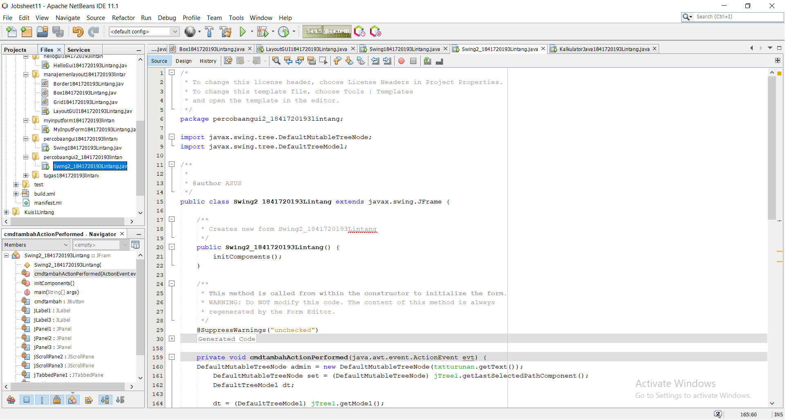
link kode program : [ini link ke kode program](../../src\11_GUI\percobaangui2_1841720193lintang\Swing2_1841720193Lintang.java)

2. Ketikkan kode class Swing Design 1 dibawah ini. 
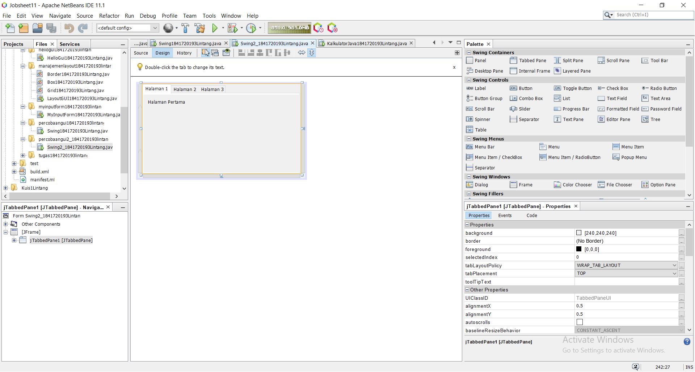

3. Ketikkan kode class Swing Design 2 dibawah ini. 
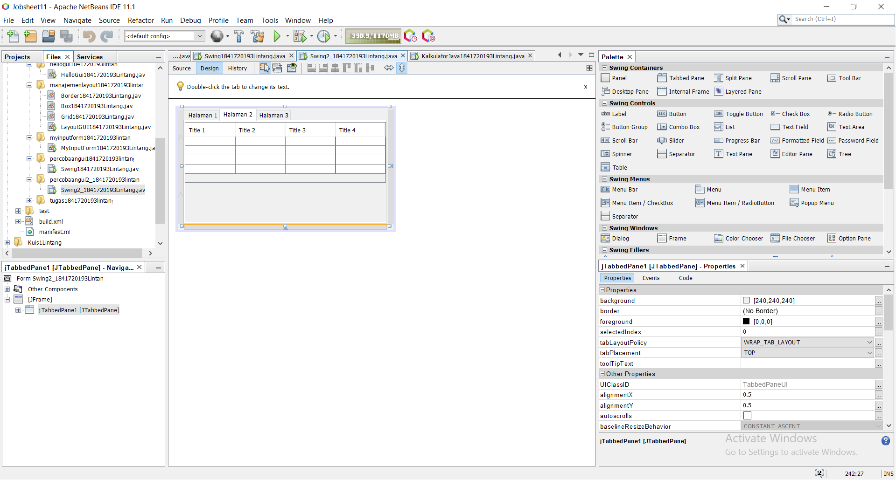

4. Ketikkan kode class Swing Design 3 dibawah ini. 
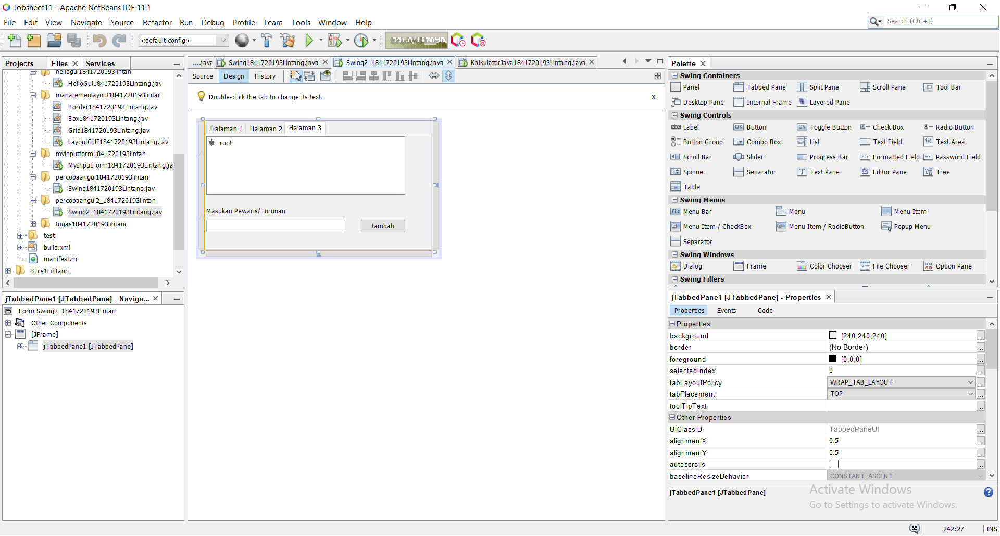

5. Ketikkan kode class Hasil Swing dibawah ini. 
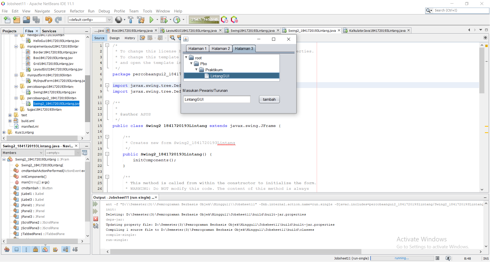

- Pertanyaan 

1. Apa kegunaan komponen swing JTabPane, JTtree, pada percobaan 5? 
Jawab : JTabPane digunakan untuk tampilan atau background nya untuk mengisi pada setiap halaman, JTree digunakan untuk menyimpan pada tambah jika button tambahnya digunakan.

2. Modifikasi program untuk menambahkan komponen JTable pada tab Halaman 1 dan tab Halaman 2?
Jawab :

### Tugas

Buatlah Sebuah Program yang mempunyai fungsi seperti kalkulator (mampu menjumlahkan, mengurangkan, mengalikan dan membagikan. Dengan tampilan seperti berikut.  

1. Ketikkan kode class Kalkulator dibawah ini. 
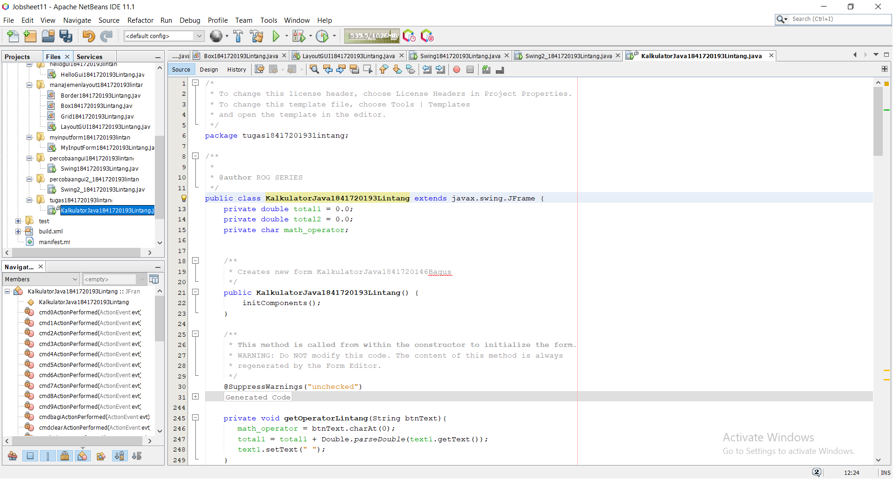
link kode program : [ini link ke kode program](../../src\11_GUI\tugas1841720193lintang\KalkulatorJava1841720193Lintang.java)

2. Ketikkan kode class Kalkulator Design dibawah ini. 
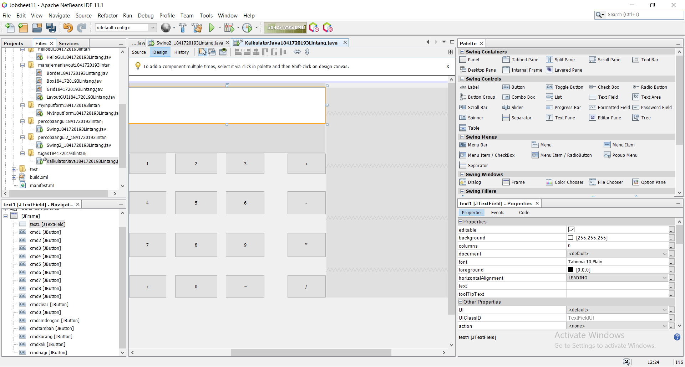

3. Ketikkan kode class Hasil dibawah ini. 
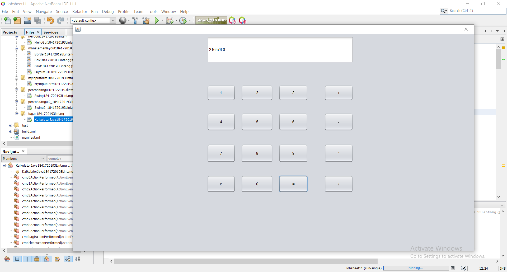

## Kesimpulan

Dari percobaan diatas, telah dipelajari kosep dari interaksi antara user dengan program hanya berbasis console editor dengan tampilan dos yang membosankan, maka agar interaksi antara user dengan program tidak membosankan diperlukanlah sebuah interface yang menghubungkan antara user dengan  program dengan tampilan grafis, interface ini dinamakan dengan GUI(Graphical User Interface).

## Pernyataan Diri

Saya menyatakan isi tugas, kode program, dan laporan praktikum ini dibuat oleh saya sendiri. Saya tidak melakukan plagiasi, kecurangan, menyalin/menggandakan milik orang lain.

Jika saya melakukan plagiasi, kecurangan, atau melanggar hak kekayaan intelektual, saya siap untuk mendapat sanksi atau hukuman sesuai peraturan perundang-undangan yang berlaku.

Ttd,

***(LINTANG KUSUMA ADJIE)***
