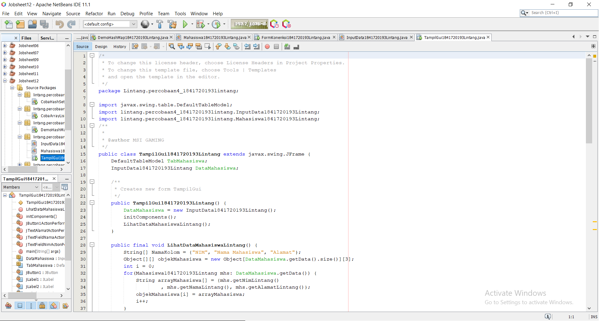

# Laporan Praktikum #12 -  12_Collection (List, Set, Map) dan Database 

Collection (List, Set, Map) dan Database 

## Kompetensi
   
1. Memahami cara penyimpanan objek menggunakan Collection dan Map. 
2. Mengetahui pengelompokan dari Collection.
3. Mengetahui perbedaan dari interface Set, List dan Map. 
4. Mengetahui penggunaan class-class dari interface Set, List, dan Map.
5. Memahami koneksi database menggunakan JDBC dan JDBC API.

## Ringkasan Materi

Collection adalah suatu objek yang bisa digunakan untuk menyimpan sekumpulan objek. Objek yang ada dalam Collection disebut elemen. Collection menyimpan elemen yang bertipe Object, sehingga berbagai tipe object bisa disimpan dalam Collection. Class-class mengenai Collection tergabung dalam Java Collection Framework. Class-class Collection diletakkan dalam package java.util dan mempunyai dua interface utama yaitu Collection.  

Collection terbagi menjadi 3 kelompok yaitu 

a. Set 
Set mengikuti model himpunan, dimana objek/anggota yang tersimpan dalam Set harus unik. Urutan maupun letak dari anggota tidak penting, hanya keberadaan anggota saja yang penting. Kelas konkrit yang mengimplementasikan Set harus memastikan bahwa tidak terdapat elemen duplikat yang dapat ditambahkan ke dalam set. Yaitu, tidak terdapat dua elemen e1 dan e2 yang berada di dalam set yang membuat e1.equals(e2) bernilai true. ClassClass yang mengimplementasikan interface Set adalah HashSet.  
HashSet dapat digunakan untuk menyimpan elemen-elemen bebas-duplikat. Kelas HashSet merupakan suatu kelas konkrit yang mengimplementasikan Set. Pembuatan objek HashSet adalah sebagai berikut: 
Set <nama_objek_HashSet> = new HashSet(); 
 
b. List 
List digunakan untuk menyimpan sekumpulan objek berdasarkan urutan masuk (ordered) dan menerima duplikat. Cara penyimpanannya seperti array, oleh sebab itu memiliki posisi awal dan posisi akhir, menyisipkan objek pada posisi tertentu, mengakses dan menghapus isi list, dimana semua proses ini selalu didasarkan pada urutannya. Class-class yang mengimplementasikan interface List adalah Vector, Stack, Linked List dan Array List. Pada jobsheet ini yang akan dibahas adalah ArrayList.  
ArrayList digunakan untuk membuat array yang ukurannya dinamis. Berbeda dengan array biasa yang ukurannya harus ditentukan di awal deklarasi array, dengan ArrayList, ukurannya akan fleksibel tergantung banyaknya elemen yang dimasukkan. Pendeklarasian object ArrayList sebaiknya diikuti dengan nama class yang akan dimasukkan dalam List tersebut. 
Tujuannya agar method dan property dari setiap object dalam ArrayList dapat diakses secara langsung. Pembuatan objek ArrayList adalah sebagai berikut: 
 
ArrayList <nama_objek_arraylist>=new ArrayList(); 
 
c. Map 
Perbedaaan mendasar map dengan collection yang lain, untuk menyimpan objek pada Map, perlu sepasang objek, yaitu key yang bersifat unik dan nilai yang disimpan. Untuk mengakses nilai tersebut maka kita perlu mengetahui key dari nilai tersebut. Map juga dikenal sebagai dictionary/kamus. Pada saat menggunakan kamus, perlu suatu kata yang digunakan untuk pencarian. Class-class yang mengimplementasikan Map adalah Hashtable,HashMap, LinkedHashMap. Pada jobsheet ini yang akan dibahas adalah HashMap. 
HashMap adalah class implementasi dar Map, Map itu sendiri adalah interface yang memiliki fungsi untuk memetakan nilai dengan key unik. HashMap berfungsi sebagai memory record management, dimana setiap record dapat disimpan dalam sebuah Map. kemudian setiap Map diletakkan pada vektor, list atau set yang masih turunan dari collection. Pembuatan objek HashMap adalah sebagai berikut: 
HashMap <nama_objek_HashMap> = new HashMap(); 
 
d. JDBC API 
JDBC API merupakan Java Database Connectivity Application Programming Interface ( JDBC  API). Pada dasarnya JDBC API terdiri dari satu set kelas dan interface yang digunakan untuk berinteraksi dengan database dari aplikasi Java. Umumnya, JDBC API melakukan 3 (tiga) fungsi berikut :   Membangun koneksi antara aplikasi Java dan database   Membangun dan mengeksekusi query   Memproses hasil 

## Praktikum

### Percobaan 1 (Set) 
 
1. Bukalah program Netbeans IDE yang sudah terinstal dikomputer anda! 

2. Buatlah project baru dengan nama JavaApi, ilustrasi project dapat dilihat pada gambar dibawah ini: 

3. Setelah itu buatlah package dengan nama identifier.percobaan1, misalnya : arie.percobaan1. 

4. Pada package tersebut buatlah java class dengan nama DemoHashSet. 
 
5. Tambahkan source code yang ada di method main()  kedalam class yang sudah anda buat! 
 
6. Jalankan program diatas, dan amati apa yang terjadi! 

1. Ketikkan kode class Hash Set dibawah ini. 

link kode program : [ini link ke kode program](../../src\12_Java_API\percobaan1_1841720193lintang\CobaHashSet1841720193Lintang.java)

2. Ketikkan kode class Hasil Hash Set dibawah ini. 

- Pertanyaan
1. Apakah fungsi import java.util.*; pada program diatas!
Jawab : Untuk mengambil semua isi pada kelas java.

2. Pada baris program keberapakah yang berfungsi untuk menciptakan object HashSet?
Jawab : Iterator<String> mIterator = mSetCity.iterator(); 

3. Apakah fungsi potongan program dibawah ini pada percobaan 1!
Jawab : Untuk menambahkan nama kota.

4. Tambahkan set.add(“Malang”); kemudian jalankan program! Amati hasilnya dan jelaskan mengapa terjadi error! 
Jawab : Karena pada programnya berfungsi untuk menyimpan elemen elemen yang terduplikat jadi ketika memanggil dengan nama yang sama maka yang keluar hanya satu saja.

5. Jelaskan fungsi potongan program dibawah ini pada percobaan 1! 
Jawab: Akan menyimpan isi dari suatu elemen sesuai dengan yang ditambahkan lalu ketika ada data yang double maka akan diambil salah satu saja.

### Percobaan 2 (List) 

1. Buatlah package dengan nama identifier.percobaan2  pada project yang sudah anda buat sebelumnya, misalnya : arie.percobaan2. 

2. Tambahkan source code berikut pada class yang sudah anda buat! 
 
3. Jalankan program diatas!  

1. Ketikkan kode class Array List dibawah ini. 

link kode program : [ini link ke kode program](../../src\12_Java_API\percobaan2_1841720193lintang\CobaArrayLisit1841720193Lintang.java)

2. Ketikkan kode class Hasil array list dibawah ini. 

- Pertanyaan
1. Apakah fungsi potongan program dibawah ini!
Jawab : Untuk mengisi datanya 

2. Ganti potongan program pada soal no 1 menjadi sebagai berikut 
Kemudian jalankan program tersebut!
Jawab : Country List
IndonesiaMalaysiaGerman

3. Jelaskan perbedaan menampilkan data pada ArrayList menggunakan potongan program pada soal no 1 dan no 2!
Jawab : Kode 1 hanya menampilkan list country nya yang di panggil dari index array yang di minta 
Kode 2 menampilkan seluruh isi dari index array nya 

### Percobaan 3 (Map)

1. Buatlah package dengan nama identifier.percobaan3  pada project yang sudah anda buat sebelumnya, misalnya : arie.percobaan3. 

2. Buatlah class baru dengan nama DemoHashMap. Tambahkan source code dibawah ini kedalam class! 

3. Jalankan program diatas, maka outputnya adalah sebagai berikut: 
 
1. Ketikkan kode class Hash Map dibawah ini. 

link kode program : [ini link ke kode program](../../src\12_Java_API\percobaan3_1841720193lintang\DemoHashMap1841720193Lintang.java)

2. Ketikkan kode class Hasil hash map dibawah ini. 

- Pertanyaan 
1. Jelaskan fungsi hMapItem.put("1","Biskuit") pada program! 
Jawab : Untuk mengisi datanya.

2. Jelaskan fungsi hMapItem.size() pada program! 
Jawab : Untuk manmpilkan hasil eksekusi dari data yang sudah ada .

3. Jelaskan fungsi hMapItem.remove("1") pada program! 
Jawab : Untuk menghapus data dari Map pada index ke 1.

4. Jelaskan fungsi hMapItem.clear() pada program!
Jawab : Untuk menghapus semua data yang ada pada map 5.

5. Tambahkan kode program yang di blok pada program yang sudah anda buat! 
Jawab : Collection mCollection = hMapItem.values();         Iterator mIterator = mCollection.iterator();         while(mIterator.hasNext()){ 
            System.out.println(mIterator.next()); 
        } 

6. Jalankan program dan amati apa yang terjadi! 
Jawab :

7. Apakah perbedaan program sebelumnya dan setelah ditambahkan kode program pada soal no 5 diatas? Jelaskan
Jawab : Perbedaannya pada program sebelumnya dengan yang baru yaitu tidak ditampilkan kembali dari nilai indeks masing masing Sedangkan kode program yang baru menampilkan indeks nya secara vertikal.

### Percobaan 4 (Implementasi ArrayList dalam GUI) 

1. Buatlah package dengan nama identifier.percobaan4  pada project yang sudah anda buat sebelumnya, misalnya : arie.percobaan4. 

2. Buatlah class baru dengan nama Mahasiswa 

3. Deklarasikan atribut Nim,Nama, Alamat dengan acces modifier private dan bertipe data String pada class Mahasiswa yang sudah dibuat 
 
4. Buatlah kontruktor pada class Mahasiswa sebagai berikut: 
 
5. Buatlah method getNim(),getNama(), dan getAlamat() 
 
6. Buatlah class baru dengan nama InputData 

7. Lakukan import ArrayList dengan menambahkan import  java.util.ArrayList; 

8. Buatlah ArrayList dengan nama ListMahasiswa dari class Mahasiswa 
 
9. Buatlah kontruktor dari class InputData kemudian isi kontruktor tersebut dengan inisialisasi dari ArrayList ListMahasiswa yang sudah anda deklarasikan sebelumnya 
 
10. Buatlah method isi data sebagai berikut: 
 
11. Buatlah method getData() untuk mengambil seleuruh data yan ada pada ListMahasiswa 

12. Buatlah class Jframe baru dengan nama TampilGui kemudian buat desain sebagai berikut: 
Ketentuan: Nama komponen Text Nama Variabel jLabel NIM jLabel1 jLabel Nama jLabel2 jLabel Alamat jLabel3 jButton Simpan jButton1 jTextField - jTextFieldNim jTextField - jTextFieldNama jTextField - jTextAlamat jTable - JTableMhs 
 
13. Tambahkan import java.swing.table.DefaultTabModel;

14. Deklarasikan DeafultTableModel sebagai TabBuku 
 
15. Kemudian buatlah objek dari class InputData  

16. Inisialisasi objek DataMahasiswa dari class Input Data didalam kontruktor TampilGui()  
 
17. Buatlah method LihatDataMahasiswa() 
 
18. Panggil method LihatDataMahasiswa() yang sudah dibuat didalam kontruktor TampilGui() 
 
19. Double klik pada Button Simpan kemudian tambahkan kode berikut: 
 
20. Jalankan program 
 
21. Tambahkan data berikut kemudian klik simpan 

22. Maka data akan tersimpan pada Jtable 
 
 
1. Ketikkan kode Input Data dibawah ini. 

link kode program : [ini link ke kode program](../../src\12_Java_API\percobaan4_1841720193lintang\InputData1841720193Lintang.java)

2. Ketikkan kode Mahasiswa dibawah ini. 

link kode program : [ini link ke kode program](../../src\12_Java_API\percobaan4_1841720193lintang\Mahasiswa1841720193Lintang.java)

3. Ketikkan kode class Tampil Gui dibawah ini. 

link kode program : [ini link ke kode program](../../src\12_Java_API\percobaan4_1841720193lintang\TampilGui1841720193Lintang.java)

4. Ketikkan kode class Hasil Tampil Gui Design dibawah ini. 

5. Ketikkan kode class Hasil Tampil Gui  dibawah ini. 

## Kesimpulan

Dari percobaan diatas, telah dipelajari kosep dari Collection adalah suatu objek yang bisa digunakan untuk menyimpan sekumpulan objek. Set mengikuti model himpunan, dimana objek/anggota yang tersimpan dalam Set harus unik List digunakan untuk menyimpan sekumpulan objek berdasarkan urutan masuk (ordered) dan menerima duplikat. ArrayList digunakan untuk membuat array yang ukurannya dinamis. Perbedaaan mendasar map dengan collection yang lain, untuk menyimpan objek pada Map, perlu sepasang objek, yaitu key yang bersifat unik dan nilai yang disimpan. JDBC API merupakan Java Database Connectivity Application Programming Interface ( JDBC API).  

## Pernyataan Diri

Saya menyatakan isi tugas, kode program, dan laporan praktikum ini dibuat oleh saya sendiri. Saya tidak melakukan plagiasi, kecurangan, menyalin/menggandakan milik orang lain.

Jika saya melakukan plagiasi, kecurangan, atau melanggar hak kekayaan intelektual, saya siap untuk mendapat sanksi atau hukuman sesuai peraturan perundang-undangan yang berlaku.

Ttd,

***(LINTANG KUSUMA ADJIE)***
