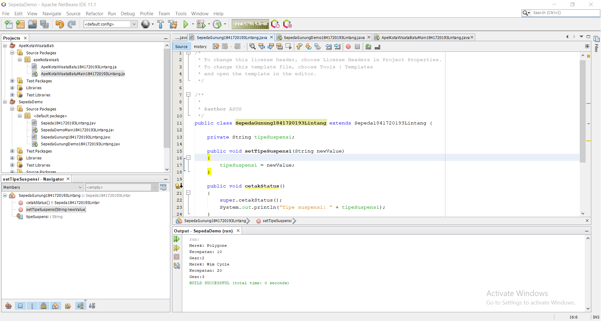
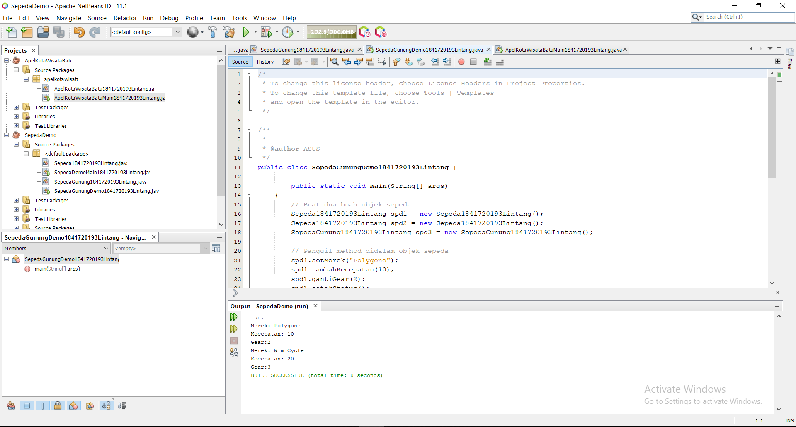
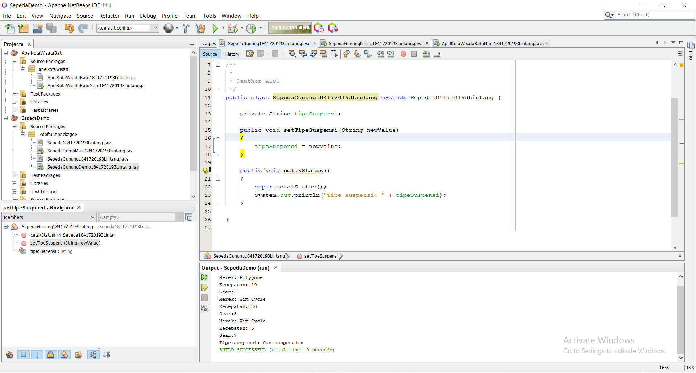
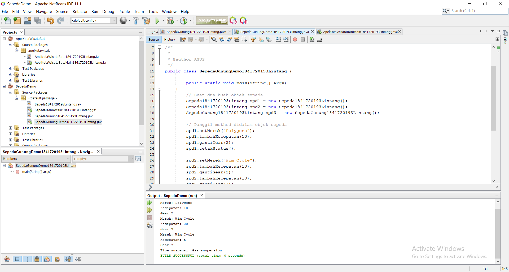
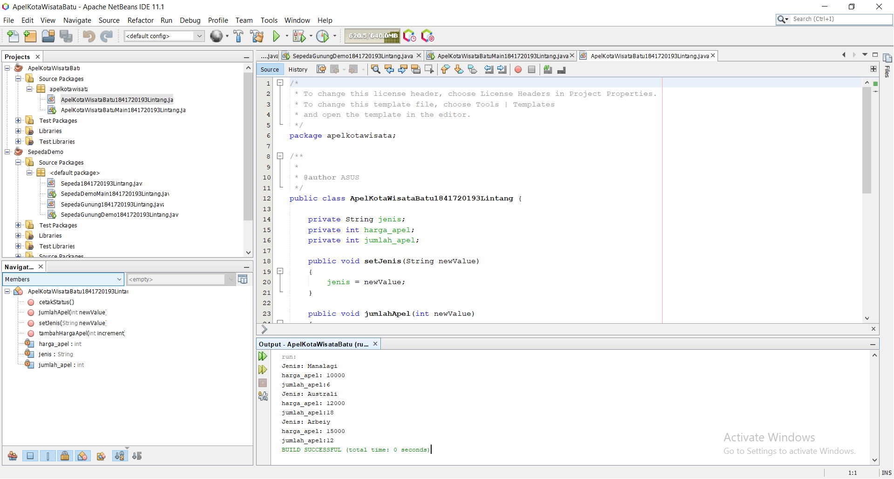
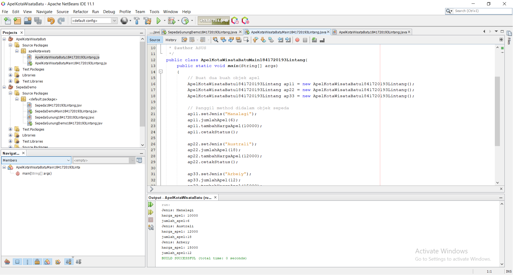

# Laporan Praktikum #1 - Pengantar Konsep PBO

## Kompetensi

(ketiklah kompetensi tiap praktikum di sini)

## Ringkasan Materi

(berisi catatan penting pribadi selama praktikum berlangsung ataupun menemukan permasalahan khusus saat melakukan percobaan)

## Percobaan

### Percobaan 1

(berisi penjelasan percobaan 1. Jika ada rujukan ke file program, bisa dibuat linknya di sini.)

`contoh screenshot yang benar, menampilkan 3 komponen, yaitu struktur project, kode program, dan hasil kompilasi`

Contoh link kode program : [ini contoh link ke kode program](../../src/1_Pengantar_Konsep_PBO/Sepeda1841720193Lintang.java)

Contoh link kode program : [ini contoh link ke kode program](../../src/1_Pengantar_Konsep_PBO/SepedaDemoMain1841720193Lintang.java)

### Percobaan 2

(berisi penjelasan percobaan 2. Jika ada rujukan ke file program, bisa dibuat linknya di sini.)

`contoh screenshot yang benar, menampilkan 3 komponen, yaitu struktur project, kode program, dan hasil kompilasi`

Contoh link kode program : [ini contoh link ke kode program](../../src/1_Pengantar_Konsep_PBO/SepedaGunung1841720193Lintang.java)

Contoh link kode program : [ini contoh link ke kode program](../../src/1_Pengantar_Konsep_PBO/SepedaGunungDemo1841720193Lintang.java)
## Pertanyaan

(1.Sebutkan dan jelaskan aspek-aspek yang ada pada pemrograman berorientasi objek!
•  Kelas — kumpulan atas definisi data dan fungsi-fungsi dalam suatu unit untuk suatu tujuan tertentu. Sebagai contoh 'class of dog' adalah suatu unit yang terdiri atas definisi-definisi data dan fungsi-fungsi yang menunjuk pada berbagai macam perilaku/turunan dari anjing. Sebuah class adalah dasar dari modularitas dan struktur dalam pemrograman berorientasi object. Sebuah class secara tipikal sebaiknya dapat dikenali oleh seorang non-programmer sekalipun terkait dengan domain permasalahan yang ada, dan kode yang terdapat dalam sebuah class sebaiknya (relatif) bersifat mandiri dan independen (sebagaimana kode tersebut digunakan jika tidak menggunakan OOP). Dengan modularitas, struktur dari sebuah program akan terkait dengan aspek-aspek dalam masalah yang akan diselesaikan melalui program tersebut. Cara seperti ini akan menyederhanakan pemetaan dari masalah ke sebuah program ataupun sebaliknya. 
•  Objek - membungkus data dan fungsi bersama menjadi suatu unit dalam sebuah program komputer; objek merupakan dasar dari modularitas dan struktur dalam sebuah program komputer berorientasi objek. 
•  Abstraksi - Kemampuan sebuah program untuk melewati aspek informasi yang diproses olehnya, yaitu kemampuan untuk memfokus pada inti. Setiap objek dalam sistem melayani sebagai model dari "pelaku" abstrak yang dapat melakukan kerja, laporan dan perubahan keadaannya, dan berkomunikasi dengan objek lainnya dalam sistem, tanpa mengungkapkan bagaimana kelebihan ini diterapkan. Proses, fungsi atau metode dapat juga dibuat abstrak, dan beberapa teknik digunakan untuk mengembangkan sebuah pengabstrakan. 
•  Enkapsulasi - Memastikan pengguna sebuah objek tidak dapat mengganti keadaan dalam dari sebuah objek dengan cara yang tidak layak; hanya metode dalam objek tersebut yang diberi izin untuk mengakses keadaannya. Setiap objek mengakses interface yang menyebutkan bagaimana objek lainnya dapat berinteraksi dengannya. Objek lainnya tidak akan mengetahui dan tergantung kepada representasi dalam objek tersebut. 
•  Polimorfisme melalui pengiriman pesan. Tidak bergantung kepada pemanggilan subrutin, bahasa orientasi objek dapat mengirim pesan; metode tertentu yang berhubungan dengan sebuah pengiriman pesan tergantung kepada objek tertentu di mana pesa tersebut dikirim. Contohnya, bila sebuah burung menerima pesan "gerak cepat", dia akan menggerakan sayapnya dan terbang. Bila seekor singa menerima pesan yang sama, dia akan menggerakkan kakinya dan berlari. Keduanya menjawab sebuah pesan yang sama, namun yang sesuai dengan kemampuan hewan tersebut. Ini disebut polimorfisme karena sebuah variabel tungal dalam program dapat memegang berbagai jenis objek yang berbeda selagi program berjalan, dan teks program yang sama dapat memanggil beberapa metode yang berbeda di saat yang berbeda dalam pemanggilan yang sama. Hal ini berlawanan dengan bahasa fungsional yang mencapai polimorfisme melalui penggunaan fungsi kelas-pertama.
2. Apa yang dimaksud dengan object dan apa bedanya dengan class?
Class merupakan kumpulan dari suatu fungsi-fungsi yang dibuat untuk suatu tujuan tertentu. Misalnya kita akan membuat sebuah Mobil. Maka yang perlu kita buatkan adalah beberapa class yang didalamnya berisi fungsi-fungsi yang dapat membuat Mobil itu dapat berjalan sebagaimana mestinya, misalnya class Roda, class Mesin, class Kerangka Mobil, class Body Mobil dan lain lain. Class masih merupakan sebuah konsep yang belum siap digunakan.
Sedangkan Object adalah pemanfaatan dari class yang siap untuk digunakan, misalnya kita sudah membuat class Roda, yang di dalamnya itu berisi konsep bagaimana Roda itu bisa berjalan, bagaimana Roda itu bisa berputar dan lain-lain, jika semua konsep Roda sudah oke, barulah kita akan dirubah menjadi sebuah Roda yang siap untuk dipakai. Nah itulah yang dinamakan Object Roda.
3. Sebutkan salah satu kelebihan utama dari pemrograman berorientasi objek dibandingkan dengan pemrograman struktural!
•	Meningkatkan produktivitas
Class dan Object pada PBO yang dibuat untuk suatu problem masih dapat dipakai lagi untuk problem lainnya yang menggunakan objek tersebut (reusable).
•	Kecepatan pengembangan
karena sistem yang didevelop dengan cara yang baik dan benar pada saat menganalisis dan merancang akan menjadikan coding yang dibuat dapat diminimalisir kesalahannya.
•	Kemudahan pemeliharaan
Karena dengan model yang ebrorientasiobjek, pola-pola yang cenderung tetap dan stabil dapat dipisahkan dan pola-pola yang bisa saja berubah.
•	Adanya konsistensi
Karena sifat inheritance dan penggunaan fase yang sama pada saat menganalisis, merancang maupun coding.
•	Meningkatkan kualitas perangkat lunak
karena pendekatan pengembangan selalu dalam keadaan yang real dan adanya konsistensi pada saat pengembangannya, perangkat lunak yang dihasilkan akan mampu memenuhi kebutuhan pemakai serta mempunyai sedikit kesalahan.
4. Pada class Sepeda, terdapat state/atribut apa saja?
setMerek,gantiGear,tambahKecepatan,rem,cetakStatus
5. Tambahkan atribut warna pada class Sepeda

6. Mengapa pada saat kita membuat class SepedaGunung, kita tidak perlu membuat class nya dari nol?
Karena sudah ke extends dengan sepeda jadi kita melanjutkan classnya Sepeda.java

)

## Tugas

(silakan kerjakan tugas di sini beserta `screenshot` hasil kompilasi program. Jika ada rujukan ke file program, bisa dibuat linknya di sini.)

`contoh screenshot yang benar, menampilkan 3 komponen, yaitu struktur project, kode program, dan hasil kompilasi`

Contoh link kode program : [ini contoh link ke kode program](../../src/1_Pengantar_Konsep_PBO/ApelKotaWisataBatu1841720193Lintang.java)

Contoh link kode program : [ini contoh link ke kode program](../../src/1_Pengantar_Konsep_PBO/ApelKotaWisataBatuMain1841720193Lintang.java)

## Kesimpulan

(Dari percobaan diatas, kita telah mendemonstrasikan bagaimana paradigma pemrograman berorientasi objek dan mengimplementasikannya kedalam program sederhana. Kita juga telah mendemonstrasikan salah satu fitur paling penting dari PBO yaitu inheritance, yaitu dalam hal membuat class SepedaGunung.  
Kita ketahui bahwa SepedaGunung pada dasarnya adalah sama dengan Sepeda (memiliki gear, memiliki kecepatan, dapat menambah kecepatan, dapat mengerem, pindah gigi, dsb) namun ada fitur tambahan yaitu tipe suspensi. Maka kita tidak perlu membuat class SepedaGunung dari nol, kita extends atau wariskan saja dari class Sepeda, kemudian kita tinggal tambahkan fitur yang sebelumnya belum ada di class Sepeda. Inilah salah satu kelebihan PBO yang tidak ada di pemrograman struktural. )

## Pernyataan Diri

Saya menyatakan isi tugas, kode program, dan laporan praktikum ini dibuat oleh saya sendiri. Saya tidak melakukan plagiasi, kecurangan, menyalin/menggandakan milik orang lain.

Jika saya melakukan plagiasi, kecurangan, atau melanggar hak kekayaan intelektual, saya siap untuk mendapat sanksi atau hukuman sesuai peraturan perundang-undangan yang berlaku.

Ttd,

***(LINTANG KUSUMA ADJIE)***