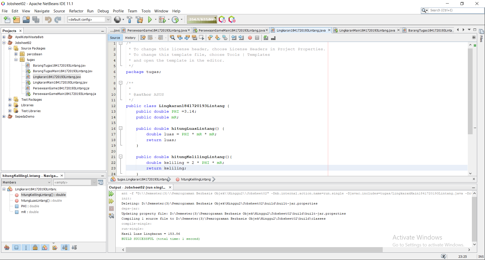

# Laporan Praktikum #2 - Pengantar Konsep PBO

## Kompetensi

1. Dapat memahami deskripsi dari class dan object 
2. Dapat Memahami implementasi dari class 
3. Dapat memahami implementasi dari attribute 
4. Dapat memahami implementasi dari method 
5. Dapat memahami implementasi dari proses instansiasi 
6. Dapat memahami implementasi dari try-catch 
7. Dapat memahami proses pemodelan class diagram menggunakan UML 

## Ringkasan Materi

Pemrograman Berorientasi Objek memiliki beberapa kelebihan dibanding Pemrograman terstruktur. Salah satunya adalah ketika kita mengubah kode program maka bisa dipastikan tidak akan mempengaruhi kode program lainya. Pemrograman Berorientasi Object di tandai dengan adanya sebuah objek yang membungkus state (atribut) dan method.

Objek sendiri adalah suatu rangkaian program yang memiliki atribut dan method. Contoh nyata dalam kehidupan sehari-hari adalah sebuah sepeda yang memiliki roda, warna, dll.Inilah yang disebut dengan atribut, sesuatu yang dimiliki atau mencirikan suatu objek. Sepeda tersebut juga memiliki method maju, mundur, berhenti, tambah kecepatan dll. Dan inilah yang disebut dengan method, sesuatu yang bisa dilakukan oleh objek tersebut.

Kemudian tentang class. Class adalah cetak biru atau rancangan dari sebuah objek.

## Percobaan

### Percobaan 1

1. Gambarkan desain class diagram dari studi kasus 1!, 

2. Sebutkan Class apa saja yang bisa dibuat dari studi kasus 1!, 
    -	Class Karyawan
    -	Class KaryawanMain

3.  Sebutkan atribut beserta tipe datanya yang dapat diidentifikasi dari masing-masing class dari studi kasus 1! 
    -	Id : int
    -	Nama : string
    -	Jenis kelamin : string
    -	Jabatan : string
    -	Gaji : int

4. Sebutkan method-method yang sudah anda buat dari masing-masing class pada studi kasus 1!
    -	tampilId()
    -	tampilNama()
    -	tampilJK()
    -	tampilJabatan()
    -	tampilGaji()
    -	cetakData()

### Percobaan 2

1. Bukalah text editor atau IDE, misalnya Notepad ++ / netbeans. 

2. Ketikkan kode program berikut ini: 

link kode program : [ini link ke kode program](../../src\2_Class_dan_Object\Mahasiswa1841720193Lintang.java)

3. Simpan dengan nama file Mahasiswa.java.

4. Untuk dapat mengakses anggota-anggota dari suatu obyek, maka harus dibuat instance dari class tersebut terlebih dahulu. Berikut ini adalah cara pengaksesan anggota- anggota dari class Mahasiswa dengan membuka file baru kemudian ketikkan kode program berikut: 

link kode program : [ini link ke kode program](../../src\2_Class_dan_Object\TestMahasiswa1841720193Lintang.java)

5. Simpan file dengan TestMahasiswa.java 

6. Jalankan class TestMahasiswa 

7. Jelaskan pada bagian mana proses pendeklarasian atribut pada program diatas!

8. Jelaskan pada bagian mana proses pendeklarasian method pada program diatas! 

9.  Berapa banyak objek yang di instansiasi pada program diatas! 
    - Objek yang di instansiasi hanya 1 yaitu mhs1

10. Apakah yang sebenarnya dilakukan pada sintaks program “mhs1.nim=101” ? 
    - Mengisi data nim

11. Apakah yang sebenarnya dilakukan pada sintaks program “mhs1.tampilBiodata()” ? 
    - Memanggil method tampilBiodataLintang untuk menampilkan biodata mahasiswa1841720193Lintang

12. Instansiasi 2 objek lagi pada program diatas! 

link kode program : [ini link ke kode program](../../src\2_Class_dan_Object\TestMahasiswa1841720193Lintang.java)

### Percobaan 3

1. Bukalah text editor atau IDE, misalnya Notepad ++ / netbeans

2. Ketikkan kode program berikut ini:
 
link kode program : [ini link ke kode program](../../src\2_Class_dan_Object\Barang1841720193Lintang.java)

3. Simpan dengan nama file Barang.java 

4. Untuk dapat mengakses anggota-anggota dari suatu obyek, maka harus dibuat instance dari class tersebut terlebih dahulu. Berikut ini adalah cara pengaksesan anggota- anggota dari class Barang dengan membuka file baru kemudian ketikkan kode program berikut: 

link kode program : [ini link ke kode program](../../src\2_Class_dan_Object\TestBarang1841720193Lintang.java)

 
5. Simpan dengan nama file TestBarang.java 

6. Jalankan program tersebut!

link kode program : [ini link ke kode program](../../src\2_Class_dan_Object\TestBarang1841720193Lintang.java)

7. Apakah fungsi argumen dalam suatu method? 
    -  Untuk mengefisienkan penulisan program dengan membagi - baginya menjadi subprogram yang kecil sehingga penulisan program menjadi tertata atau terstruktur rapi.

8. Ambil kesimpulan tentang kegunaan dari kata kunci return , dan kapan suatu method harus memiliki return! 
    - Returnt digunakan untuk tipe data method int karna method tersebut harus mengembalikan nilai int

## Tugas

1. Suatu toko persewaan video game salah satu yang diolah adalah peminjaman, dimana data yang dicatat ketika ada orang yang melakukan peminjaman adalah id, nama member, nama game, dan harga yang harus dibayar. Setiap peminjaman bisa menampilkan data hasil peminjaman dan harga yang harus dibayar. Buatlah class diagram pada studi kasus diatas! 
 
Penjelasan: 
    - Harga yang harus dibayar diperoleh dari lama sewa x harga. 
    - Diasumsikan 1x transaksi peminjaman game yang dipinjam hanya 1 game saja. 

2. Buatlah program dari class diagram yang sudah anda buat di no 1! 

link kode program : [ini link ke kode program](../../src\2_Class_dan_Object\PersewaanGame1841720193Lintang.java)
link kode program : [ini link ke kode program](../../src\2_Class_dan_Object\PersewaanGameMain1841720193Lintang.java)

3. Buatlah program sesuai dengan class diagram berikut ini: 

link kode program : [ini link ke kode program](../../src\2_Class_dan_Object\Lingkaran1841720193Lintang.java)
link kode program : [ini link ke kode program](../../src\2_Class_dan_Object\LingkaranMain1841720193Lintang.java)

4. Buatlah program sesuai dengan class diagram berikut ini: 
Deskripsi / Penjelasan : 
    - Nilai atribut hargaDasar dalam Rupiah dan atribut diskon dalam % 
    - Method hitungHargaJual() digunakan untuk menghitung harga jual dengan perhitungan berikut ini: harga jual = harga dasar – (diskon x harga dasar) 
    - Method tampilData() digunakan untuk menampilkan nilai dari kode, namaBarang, hargaDasar, diskon dan harga jual. 

link kode program : [ini link ke kode program](../../src\2_Class_dan_Object\BarangTugas1841720193Lintang.java)
link kode program : [ini link ke kode program](../../src\2_Class_dan_Object\BarangTugasMain1841720193Lintang.java)

## Kesimpulan

- Method dengan tipe data void tidak memerlukan return 
- Method dengan tipe data int, double, float (selain void) memerlukan return  
- Atribut dengan modifier public dapat diakses pada class manapun 
- Atribut dengan modifier private hanya dapat diakses pada class tersebut 
- Object dapat memanggil method, contohnya : mb1.setID("MB-001"); , mb1 adalah nama dari object 
- Object dapat memanggil atribut, contohnya: brg1.diskon, brg1 adalah nama dari object

## Pernyataan Diri

Saya menyatakan isi tugas, kode program, dan laporan praktikum ini dibuat oleh saya sendiri. Saya tidak melakukan plagiasi, kecurangan, menyalin/menggandakan milik orang lain.

Jika saya melakukan plagiasi, kecurangan, atau melanggar hak kekayaan intelektual, saya siap untuk mendapat sanksi atau hukuman sesuai peraturan perundang-undangan yang berlaku.

Ttd,

***(LINTANG KUSUMA ADJIE)***
