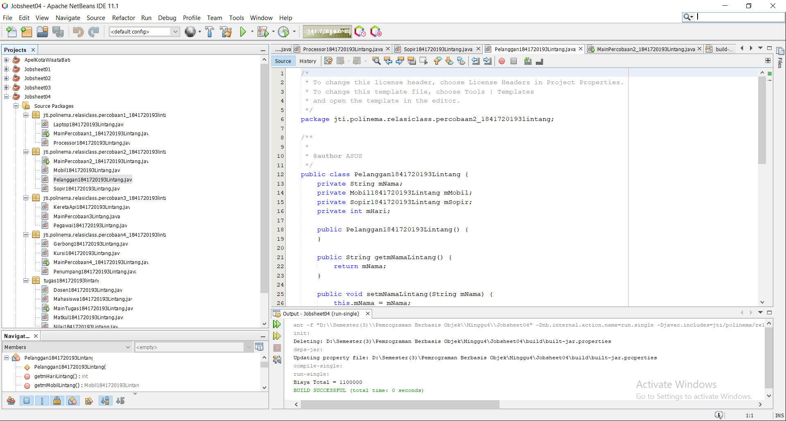
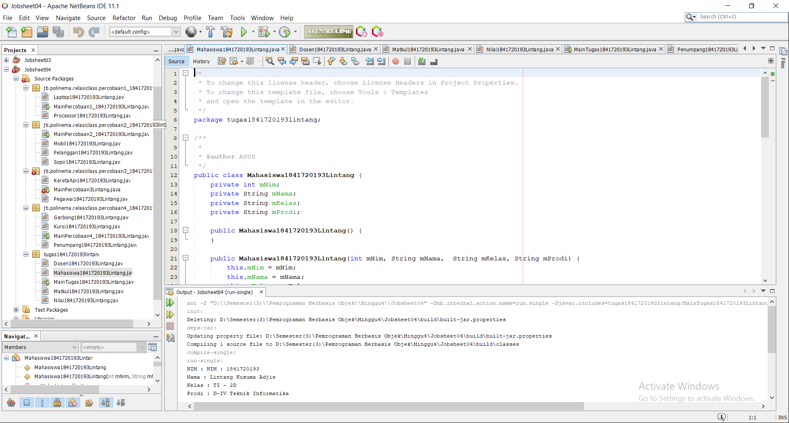

# Laporan Praktikum #4 -  4_Relasi_Class

Relasi Kelas 

## Kompetensi

1. Memahami konsep relasi kelas; 
2. Mengimplementasikan relasi has‑a dalam program. 

## Ringkasan Materi

Pada kasus yang lebih kompleks, dalam suatu sistem akan ditemukan lebih dari satu class yang saling memiliki keterkaitan antara class satu dengan yang lain. Pada percobaan‑percobaan sebelumnya, mayoritas kasus yang sudah dikerjakan hanya fokus pada satu class saja. Pada jobsheet ini akan dilakukan percobaan yang melibatkan beberapa class yang saling berelasi. 

Misalnya terdapat class Laptop yang memiliki atribut berupa merk dan prosesor. Jika diperhatikan lebih rinci, maka atribut prosesor sendiri didalamnya memiliki data berupa merk, nilai cache memori, dan nilai clock‑nya. Artinya, ada class lain yang namanya Processor yang memiliki atribut merk, cache dan clock, dan atribut prosesor yang ada di dalam class Laptop itu merupakan objek dari class Proceessor tersebut. Sehingga terlihat antara class Laptop dan class Processor memiliki relasi (has‑a). 

Jenis relasi has‑a ini yang akan dicontohkan pada percobaan di jobsheet ini. Apabila dilihat lebih rinci lagi, relasi tersebut disebut juga dengan agregasi (has-a). Relasi antar kelas yang lain adalah dependensi (uses-a) dan inheritance (is-a). Diperlukan inisiatif mandiri dari tiap mahasiswa untuk memperdalam jenis relasi lain terutama yang tidak dibahas pada mata kuliah ini. 

## Praktikum

### Percobaan 1 
a.	Perhatikan diagram class berikut: 
   
b.	Buka project baru di Netbeans dan buat package dengan format berikut: 
<identifier>.relasiclass.percobaan1 (ganti dengan identitas anda atau nama domain), Contoh: ac.id.polinema, jti.polinema, dan sebagainya). 
 
Catatan: Penamaan package dengan tambahan identifier untuk menghindari adanya kemungkinan penamaan class yang bentrok. 
 
c.	Buatlah class Processor dalam package tersebut. 
public class Processor { } 
 
d.	Tambahkan atribut merk dan cache pada class Processor dengan akses modifier private . 
private String merk; 
private double cache; 
 
e.	Buatlah constructor default untuk class Processor. 
 
f.	Buatlah constructor untuk class Processor dengan parameter merk dan cache. 
 
g.	Implementasikan setter dan getter untuk class Processor. 
 
h.	Implementasikan method info() seperti berikut: 
public void info() { 
System.out.printf("Merk Processor = %s\n", merk); 
System.out.printf("Cache Memory = %.2f\n", cache); 
} 
 
i.	Kemudian buatlah class Laptop di dalam package yang telah anda buat. 
 
j.	Tambahkan atribut merk dengan tipe String dan proc dengan tipe Object Processor  
private String merk; 
private Processor proc; 
 
k.	Buatlah constructor default untuk class Laptop . 
 
l.	Buatlah constructor untuk class Laptop dengan parameter merk dan proc . 
 
m.	Selanjutnya implementasikan method info() pada class Laptop sebagai berikut 
public void info() { 
System.out.println("Merk Laptop = " + merk); proc.info(); 
} 
 
n.	Pada package yang sama, buatlah class MainPercobaan1 yang berisi method main(). 
 
o.	Deklarasikan Object Processor dengan nama p kemudian instansiasi dengan informasi atribut Intel i5 untuk nilai merk serta 3 untuk nilai cache . 
Processor p = new Processor("Intel i5", 3); 
 
p.	Kemudian deklarasikan serta instansiasi Objek Laptop dengan nama L dengan informasi atribut Thinkpad dan Objek Processor yang telah dibuat. 
 
q.	Panggil method info() dari Objek L. 
L.info(); 
 
r.	Tambahkan baris kode berikut 
Processor p1 = new Processor(); p1.setMerk("Intel i5"); p1.setCache(4); 
Laptop L1 = new Laptop(); 
L1.setMerk("Thinkpad"); 
L1.setProc(p1); L1.info(); 
 
s.	Compile kemudian run class MainPercobaan1, akan didapatkan hasil seperti berikut: 

1. Ketikkan kode class Processor dibawah ini. 

link kode program : [ini link ke kode program](../../src\4_Relasi_Class\Processor1841720193Lintang.java)

2. Ketikkan kode class Laptop dibawah ini. 

link kode program : [ini link ke kode program](../../src\4_Relasi_Class\Laptop1841720193Lintang.java)

4. Ketikkan kode class Main1 dibawah ini. 

link kode program : [ini link ke kode program](../../src\4_Relasi_Class\MainPercobaan1_1841720193Lintang.java)

5. Ketikkan kode class Hasil1 dibawah ini. 

### Pertanyaan 1 

1. Di dalam class Processor dan class Laptop , terdapat method setter dan getter untuk masing‑masing atributnya. Apakah gunanya method setter dan getter tersebut ? 
Jawab : fungsinya sesuai dengan namanya yaitu untu menge-set (memberi nilai) dan menge-get (mendapatkan/melihat nilai) pada suatu variabel atau class dengan contructor default

2. Di dalam class Processor dan class Laptop, masing‑masing terdapat konstruktor default dan konstruktor berparameter. Bagaimanakah beda penggunaan dari kedua jenis konstruktor tersebut ? 
Jawab : bila konstruktor default, untuk memberi nilai menggunakan setter, tetapi jika kita menggunakan konstruktor berparameter, kita hanya perlu memberi nilai di parameter pada objek di class main.
 
3. Perhatikan class Laptop, di antara 2 atribut yang dimiliki (merk dan proc), atribut manakah yang bertipe object ? 
Jawab : proc, karena inisiasi tipe variabel ditandai dengan nama object.

4. Perhatikan class Laptop, pada baris manakah yang menunjukan bahwa class Laptop memiliki relasi dengan class Processor ? 
Jawab :  Terlihat jelas pada constructor, terdapat parameter yang menggunakan object Processor yang telah diinisiasi sebelumnya.

5. Perhatikan pada class Laptop , Apakah guna dari sintaks proc.info() ? 
Jawab : proc.Info(), merupakan syntax yang digunakan untuk menjalankan method Info() pada class Processor.

6. Pada class MainPercobaan1, terdapat baris kode: Laptop l = new Laptop("Thinkpad", p);. Apakah p tersebut ? Dan apakah yang terjadi jika baris kode tersebut diubah menjadi: Laptop l = new Laptop("Thinkpad", new Processor("Intel i5", 3)); Bagaimanakah hasil program saat dijalankan, apakah ada perubahan ?
Jawab : p merupakan object dari class Processor yang tadi telah diinstansiasi, Lalu kode program yang baru hasilnya sama saja, kode program tersebut memiliki perbedaan pada instansiasi dalam bentuk variabel object, bila pada kode program tersebut object tidak perlu diinstansiasi kedalam variabel lain tetapi ter nested atau bisa dibilang melakukan instansiasi objek dialam instansiasi object.  

###  Percobaan 2 
Perhatikan diagram class berikut yang menggambarkan sistem rental mobil. Pelanggan bisa menyewa mobil sekaligus sopir. Biaya sopir dan biaya sewa mobil dihitung per hari. 
   
a.	Tambahkan package <identifier>.relasiclass.percobaan2. 
 
b.	Buatlah class Mobil di dalam package tersebut. 
 
c.	Tambahkan atribut merk tipe String dan biaya tipe int dengan akses modifier 
private. 
 
d.	Tambahkan constructor default serta setter dan getter. 
 
e.	Implementasikan method hitungBiayaMobil 
 public int hitungBiayaMobil(int hari) { return biaya * hari; 
} 
 
f.	Tambahkan class Sopir dengan atribut nama tipe String dan biaya tipe int dengan akses modifier private berikut dengan constructor default. 

g.	Implementasikan method hitungBiayaSopir 
 public int hitungBiayaSopir(int hari) { return biaya * hari; 
} 
 
h.	Tambahkan class Pelanggan dengan constructor default. 
 
i.	Tambahkan atribut‑atribut dengan akses modifier private berikut:  
Atribut 	Tipe 
nama 	String 
mobil 	Mobil 
sopir 	Sopir 
hari 	int 
 
j.	Implementasikan setter dan getter. 
 
k.	Tambahkan method hitungBiayaTotal 
public int hitungBiayaTotal() { return mobil.hitungBiayaMobil(hari) + sopir.hitungBiayaSopir(hari); 
} 
 
l.	Buatlah class MainPercobaan2 yang berisi method main(). Tambahkan baris kode berikut: 
 
Mobil m = new Mobil(); 
m.setMerk("Avanza"); 
m.setBiaya(350000); Sopir s = new Sopir(); s.setNama("John Doe"); 
s.setBiaya(200000); 
Pelanggan p = new Pelanggan(); 
p.setNama("Jane Doe"); 
p.setMobil(m); 
p.setSopir(s); 
p.setHari(2); 
System.out.println("Biaya Total = " +  
p.hitungBiayaTotal()); 
 
m. Compile dan jalankan class MainPercobaan2, dan perhatikan hasilnya!

1. Ketikkan kode class Mobil dibawah ini. 

link kode program : [ini link ke kode program](../../src\4_Relasi_Class\Mobil1841720193Lintang.java)

2. Ketikkan kode class Pelanggan dibawah ini. 

link kode program : [ini link ke kode program](../../src\4_Relasi_Class\Pelanggan1841720193Lintang.java)

3. Ketikkan kode class Sopir dibawah ini. 

link kode program : [ini link ke kode program](../../src\4_Relasi_Class\Sopir1841720193Lintang.java)

4. Ketikkan kode class Main2 dibawah ini. 

link kode program : [ini link ke kode program](../../src\4_Relasi_Class\MainPercobaan2_1841720193Lintang.java)

5. Ketikkan kode class Hasil2 dibawah ini. 

### Pertanyaan 2

1. Perhatikan class Pelanggan. Pada baris program manakah yang menunjukan bahwa class Pelanggan memiliki relasi dengan class Mobil dan class Sopir ? 
Jawab :  Dapat dilihat pada inisiasi  variabel object di class pelanggan

2. Perhatikan method hitungBiayaSopir pada class Sopir, serta method hitungBiayaMobil pada class Mobil. Mengapa menurut Anda method tersebut harus memiliki argument hari ? 
Jawab : argumen tersebut nantinya digunakan untuk diisi dengan variabel int hari pada class Pelanggan 
 
3. Perhatikan kode dari class Pelanggan. Untuk apakah perintah mobil.hitungBiayaMobil(hari) dan sopir.hitungBiayaSopir(hari) ? 
Jawab : kode program tersebut digunakan untuk menjumlahkan biaya mobil yang diambil dari harga sopir dikali dengan hari lalu yang dijumlahkan dengan biaya sopir yang diambil dari harga sopir dikali hari.

4. Perhatikan class MainPercobaan2. Untuk apakah sintaks p.setMobil(m) dan p.setSopir(s) ? 
Jawab : kode program tersebut digunakan untuk memberi atau mengisi nilai dari namaMobil dan namaSopir yang ada pada objek pelanggan

5. Perhatikan class MainPercobaan2. Untuk apakah proses p.hitungBiayaTotal() tersebut ? 
Jawab : digunakan untuk menghitung biaya total dari penjumlahan antara biaya sopir dan biaya mobil.

6. Perhatikan class MainPercobaan2, coba tambahkan pada baris terakhir dari method main dan amati perubahan saat di‑run! 
System.out.println(p.getMobil().getMerk()); 
Jadi untuk apakah sintaks p.getMobil().getMerk() yang ada di dalam method main tersebut? 
Jawab : perintah tersebut digunakan untuk menggembalikan atau me return nilai atribut dari method  getMerk() pada class Mobil melalui objek pelanggan, atau setelah me return object Mobil pada class pelanggan, object mobil akan me return String getMerk() pada class mobil

###  Percobaan 3
Pada percobaan‑percobaan sebelumnya, relasi dalam class dinyatakan dalam one‑to‑one. Tetapi ada kalanya relasi class melibatkan lebih dari satu. Hal ini disebut dengan multiplicity. Untuk relasi lebih rinci mengenai multiplicity, dapat dilihat pada tabel berikut. 
 
a. Sebuah Kereta Api dioperasikan oleh Masinis serta seorang Asisten Masinis. Baik Masinis maupun Asisten Masinis keduanya merupakan Pegawai PT. Kereta Api Indonesia. Dari ilustrasi cerita tersebut, dapat digambarkan dalam diagram kelas sebagai berikut: 
 
b. Perhatikan dan pahami diagram kelas tersebut, kemudian bukalah IDE anda! 

c. Buatlah package <identifier>.relasiclass.percobaan3, kemudian tambahkan class Pegawai. 
Page 7 of 10 
 
d. Tambahkan atribut‑atribut ke dalam class Pegawai 
private String nip; private String nama; 
 
e. Buatlah constructor untuk class Pegawai dengan parameter nip dan nama. 
 
f. Tambahkan setter dan getter untuk masing‑masing atribut. 
 
g. Implementasikan method info() dengan menuliskan baris kode berikut: 
public String info() { String info = ""; info += "Nip: " + this.nip + "\n"; info += "Nama: " + this.nama + "\n"; return info; } 
 
h. Buatlah class KeretaApi berdasarkan diagram class. 
 
i. Tambahkan atribut‑atribut pada class KeretaApi berupa nama, kelas, masinis, dan asisten. 
private String nama; private String kelas; private Pegawai masinis; private Pegawai asisten; 
 
j. Tambahkan constructor 3 parameter (nama, kelas, masinis) serta 4 parameter (nama, kelas, masinis, asisten). 
 
k. Tambahkan setter dan getter untuk atribut‑atribut yang ada pada class KeretaApi . 
 
l. Kemudian implementasikan method info() 
public String info() { String info = ""; info += "Nama: " + this.nama + "\n"; info += "Kelas: " + this.kelas + "\n"; info += "Masinis: " + this.masinis.info() + "\n"; info += "Asisten: " + this.asisten.info() + "\n"; return info; } 
 
m. Buatlah sebuah class MainPercobaan3 dalam package yang sama. 
 
n. Tambahkan method main() kemudian tuliskan baris kode berikut. 
Pegawai masinis = new Pegawai("1234", "Spongebob Squarepants"); Pegawai asisten = new Pegawai("4567", "Patrick Star"); 
Page 8 of 10 
KeretaApi keretaApi = new KeretaApi("Gaya Baru", "Bisnis", masinis, asisten); 
System.out.println(keretaApi.info());

1. Ketikkan kode class Kereta Api dibawah ini. 

link kode program : [ini link ke kode program](../../src\4_Relasi_Class\KeretaApi1841720193Lintang.java)

2. Ketikkan kode class Pegawai dibawah ini. 

link kode program : [ini link ke kode program](../../src\4_Relasi_Class\Pegawai1841720193Lintang.java)

3. Ketikkan kode class Main3 dibawah ini. 

link kode program : [ini link ke kode program](../../src\4_Relasi_Class\MainPercobaan3_1841720193Lintang.java)

4. Ketikkan kode class Hasil3 dibawah ini. 

### Pertanyaan 3

1. Di dalam method info() pada class KeretaApi, baris this.masinis.info() dan this.asisten.info() digunakan untuk apa ? 
Jawab : digunakan untuk memanggil method Info yang berada di class Pegawai melalui object masinis dan asisten

2. Buatlah main program baru dengan nama class MainPertanyaan pada package yang sama. Tambahkan kode berikut pada method main() ! 
Pegawai masinis = new Pegawai("1234", "Spongebob Squarepants"); KeretaApi keretaApi = new KeretaApi("Gaya Baru", "Bisnis", masinis); 
System.out.println(keretaApi.info()); 
 
3. Apa hasil output dari main program tersebut ? Mengapa hal tersebut dapat terjadi ? 
Jawab : FAILED, dapat dilihat dalam gambar diatas karane ada variabel yang tidak bernilai atau disebut dengan null, dan variabel tersebut adalah object asisten pada class KeretaApi

4. Perbaiki class KeretaApi sehingga program dapat berjalan ! 

###  Percobaan 4 

a.	Perhatikan dan pahami diagram class tersebut. 
 
b.	Buatlah masing‑masing class Penumpang, Kursi dan Gerbong sesuai rancangan tersebut pada package <identifier>.relasiclass.percobaan4. 
 
c.	Tambahkan method info() pada class Penumpang 
public String info() { String info = ""; info += "Ktp: " + ktp + "\n"; info += "Nama: " + nama + "\n"; return info; 
} 
 
d.	Tambahkan method info() pada class Kursi 
public String info() { String info = ""; 
info += "Nomor: " + nomor + "\n"; if (this.penumpang != null) { 
info += "Penumpang: " + penumpang.info() + "\n"; 
} return info; 
} 
 
e.	Pada class Gerbong buatlah method initKursi() dengan akses private. 
private void initKursi() { for (int i = 0; i < arrayKursi.length; i++) { this.arrayKursi[i] = new Kursi(String.valueOf(i + 1)); } 
} 
 
f.	Panggil method initKursi() dalam constructor Gerbong sehingga baris kode menjadi berikut: 
public Gerbong(String kode, int jumlah) { this.kode = kode; 
this.arrayKursi = new Kursi[jumlah]; this.initKursi(); 
} 
 
g.	Tambahkan method info() pada class Gerbong 
public String info() { String info = ""; 
info += "Kode: " + kode + "\n"; for (Kursi kursi : arrayKursi) { info += kursi.info(); 
} return info; 
} 
 
h.	Implementasikan method untuk memasukkan penumpang sesuai dengan nomor kursi. 
public void setPenumpang(Penumpang penumpang, int nomor) { this.arrayKursi[nomor - 1].setPenumpang(penumpang); 
} 
 
i.	Buatlah class MainPercobaan4 yang berisi method main(). Kemudian tambahkan baris berikut! 
Penumpang p = new Penumpang("12345", "Mr. Krab"); 
Gerbong gerbong = new Gerbong("A", 10); gerbong.setPenumpang(p, 1); System.out.println(gerbong.info()); 
 
1. Ketikkan kode class Gerbong dibawah ini. 

link kode program : [ini link ke kode program](../../src\4_Relasi_Class\Gerbong1841720193Lintang.java)

2. Ketikkan kode class Kursi dibawah ini. 

link kode program : [ini link ke kode program](../../src\4_Relasi_Class\Kursi1841720193Lintang.java)

3. Ketikkan kode class Penumpang dibawah ini. 

link kode program : [ini link ke kode program](../../src\4_Relasi_Class\Penumpang1841720193Lintang.java)

4. Ketikkan kode class Main4 dibawah ini. 

link kode program : [ini link ke kode program](../../src\4_Relasi_Class\MainPercobaan4_1841720193Lintang.java)

5. Ketikkan kode class Hasil4 dibawah ini. 

### Pertanyaan 4

1.	Pada main program dalam class MainPercobaan4, berapakah jumlah kursi dalam Gerbong A ?
Jawab : 10, dapat dilihat pada instansiasi new Gerbong atau pada output bisa dilihat perulangan “Nomer : 10” 

2.	Perhatikan potongan kode pada method info() dalam class Kursi. Apa maksud kode tersebut ? 
... if (this.penumpang != null) { info += "Penumpang: " + penumpang.info() + "\n"; 
} ... 
Jawab : potongan kode program tersebut digunakan untuk menampilkan kursi yang terisi oleh penumpang, tetapi bila penumpang tidak bernilai atau null, maka kode program yang terdapat pada if tidak dijalankan atau berarti kursi tersebut masih kosong
 
3.	Mengapa pada method setPenumpang() dalam class Gerbong, nilai nomor dikurangi dengan angka 1 ?
Jawab : karena index array selalu dimulai dari 0, oleh karena itu nilai nomer harus dikurangi 1 agar array di index 0 atau di index pertama dapat terisi

4.	Instansiasi objek baru budi dengan tipe Penumpang, kemudian masukkan objek baru tersebut pada gerbong dengan gerbong.setPenumpang(budi, 1). Apakah yang terjadi ? 

5.	Modifikasi program sehingga tidak diperkenankan untuk menduduki kursi yang sudah ada penumpang lain ! 

## Tugas

Buatlah sebuah studi kasus, rancang dengan class diagram, kemudian implementasikan ke dalam program! Studi kasus harus mewakili relasi class dari percobaan‑percobaan yang telah dilakukan pada materi ini, setidaknya melibatkan minimal 4 class (class yang berisi main tidak dihitung). 

1. Ketikkan kode class Dosen Tugas dibawah ini. 

link kode program : [ini link ke kode program](../../src\4_Relasi_Class\Dosen1841720193Lintang.java)

2. Ketikkan kode class Mahasiswa Tugas dibawah ini. 

link kode program : [ini link ke kode program](../../src\4_Relasi_Class\Mahasiswa1841720193Lintang.java)

3. Ketikkan kode class Matkul Tugas dibawah ini. 

link kode program : [ini link ke kode program](../../src\4_Relasi_Class\Matkul1841720193Lintang.java)

4. Ketikkan kode class Nilai Tugas dibawah ini. 

link kode program : [ini link ke kode program](../../src\4_Relasi_Class\Nilai1841720193Lintang.java)

5. Ketikkan kode class Main Tugas dibawah ini. 

link kode program : [ini link ke kode program](../../src\4_Relasi_Class\MainTugas1841720193Lintang.java)

6. Ketikkan kode class Hasil Tugas dibawah ini. 

## Kesimpulan

Dari percobaan diatas, telah dipelajari kosep dari Relasi Kelas dalam suatu sistem akan ditemukan lebih dari satu class yang saling memiliki keterkaitan antara class satu dengan yang lain. Pada percobaan‑percobaan sebelumnya, mayoritas kasus yang sudah dikerjakan hanya fokus pada satu class saja. Pada jobsheet ini dilakukan percobaan yang melibatkan beberapa class yang saling berelasi.

## Pernyataan Diri

Saya menyatakan isi tugas, kode program, dan laporan praktikum ini dibuat oleh saya sendiri. Saya tidak melakukan plagiasi, kecurangan, menyalin/menggandakan milik orang lain.

Jika saya melakukan plagiasi, kecurangan, atau melanggar hak kekayaan intelektual, saya siap untuk mendapat sanksi atau hukuman sesuai peraturan perundang-undangan yang berlaku.

Ttd,

***(LINTANG KUSUMA ADJIE)***
