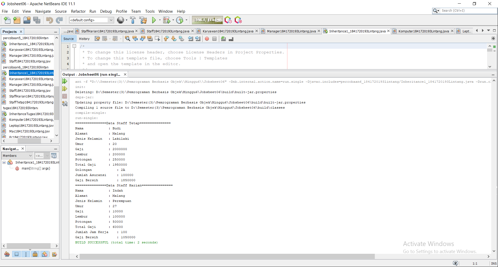

# Laporan Praktikum #7 -  7_OVERLOADING DAN OVERRIDING 

Inheritance

## Kompetensi
   
Setelah menempuh pokok bahasan ini, mahasiswa mampu : a. Memahami konsep overloading dan overriding, 
b.	Memahami perbedaan overloading dan overriding, 
c.	Ketepatan dalam mengidentifikasi method overriding dan overloading 
d.	Ketepatan dalam mempraktekkan instruksi pada jobsheet 
e.	Mengimplementasikan method overloading dan overriding. 

## Ringkasan Materi

Overloading  adalah menuliskan kembali method dengan nama yang sama pada suatu class. Tujuannya dapat memudahkan penggunaan/pemanggilan method dengan fungsionalitas yang mirip. 
Untuk aturan pendeklarasian method Overloading sebagai berikut: 
    	Nama method harus sama. 
    	Daftar parameter harus berbeda. 
    	Return type boleh sama, juga boleh berbeda. 
Ada beberapa daftar parameter pada overloading dapat dilihat sebagai berikut: 
    	Perbedaan daftar parameter bukan hanya terjadi pada perbedaan banyaknya parameter, tetapi juga urutan darai parameter tersebut. 
    	Misalnya saja dua buah parameter berikut ini: 
o Function_member (int x, string n) o Function_member (String n, int x) 
    	Dua parameter tersebut juga di anggap berbeda daftar parameternya. 
    	Daftar parameter tidak terkait dengan penamaan variabel yang ada dalam parameter. 
    	Misalnya saja 2 daftar parameter berikut : 
o function_member(int x) o function_member(int y)  Dua daftar parameter diatas dianggap sama karena yang berbeda hanya penamaan variable parameternya saja. 
Overloading juga bisa terjadi antara parent class dengan subclass-nya jika memenuhi ketiga syarat overload. Ada beberapa aturan overloading yaitu: 
    	Primitive widening conversion didahulukan dalam overloading dibandingkan boxing dan var args.  
    	Kita tidak dapat melakukan proses widening dari tipe wrapper ke tipe wrapper lainnya (mengubah Integer ke Long). 
    	Kita tidak dapat melakukan proses widening dilanjutkan boxing (dari int menjadi Long) 
    	Kita dapat melakukan boxing dilanjutkan dengan widening (int dapat menjadi Object melalui Integer) 
    	Kita dapat menggabungkan var args dengan salah satu yaitu widening atau boxing  
 
Overriding  adalah Sublass yang berusaha memodifkasi tingkah laku yang diwarisi dari superclass. Tujuannya subclass dapat memiliki tingkah laku yang lebih spesifik sehingga dapat dilakukan dengan cara mendeklarasikan kembali method milik parent class di subclass. 
Deklarasi method pada subclass harus sama dengan yang terdapat di super class. 
Kesamaan pada: 
    	Nama 
    	Return type (untuk return type : class A atau merupakan subclass dari class A) 
    	Daftar parameter (jumlah, tipe dan urutan) 
Sehingga method pada parent class disebut overridden method dan method pada subclass disebut overriding method. Ada beberapa aturan method didalam overriding: 
    	Mode akses overriding method harus sama atau lebih luas dari pada overridden method. 
    	Subclass hanya boleh meng-override method superclass satu kali saja, tidak boleh ada lebih dari satu method pada kelas yang sama persis. 
    	Overriding method tidak boleh throw checked exceptions yang tidak dideklarasikan oleh overridden method. 

## Praktikum

### Percobaan 1
   
Untuk kasus contoh berikut ini, terdapat tiga kelas, yaitu Karyawan, Manager, dan Staff. Class Karyawan merupakan superclass dari Manager dan Staff dimana subclass Manager dan Staff memiliki method untuk menghitung gaji yang berbeda. 

1. Ketikkan kode class Karyawan dibawah ini. 

link kode program : [ini link ke kode program](../../src\7_OVERLOADING DAN OVERRIDING \percobaan1_1841720193lintang\ClassA1841720193Lintang.java)

2. Ketikkan kode class Extends dibawah ini. 

link kode program : [ini link ke kode program](../../src\6_Inheritance\percobaan1_1841720193lintang\ClassB1841720193Lintang.java)

3. Ketikkan kode class Extends dibawah ini. 

link kode program : [ini link ke kode program](../../src\6_Inheritance\percobaan1_1841720193lintang\Percobaan1_1841720193Lintang.java)

4. Ketikkan kode class Hasil1 dibawah ini. 

### Pertanyaan 1 

1. Pada percobaan 1 diatas program yang dijalankan terjadi error, kemudian perbaiki sehingga program tersebut bisa dijalankan dan tidak error!
Jawab : 
    1. Ketikkan kode class Extends dibawah ini. 

link kode program : [ini link ke kode program](../../src\6_Inheritance\percobaan1_1841720193lintang\ClassA1841720193Lintang.java)

    2. Ketikkan kode class Extends dibawah ini. 

link kode program : [ini link ke kode program](../../src\6_Inheritance\percobaan1_1841720193lintang\ClassB1841720193Lintang.java)

    3. Ketikkan kode class Extends dibawah ini. 

link kode program : [ini link ke kode program](../../src\6_Inheritance\percobaan1_1841720193lintang\Percobaan1_1841720193Lintang.java)

    4. Ketikkan kode class Hasil 1 dibawah ini. 

2. Jelaskan apa penyebab program pada percobaan 1 ketika dijalankan terdapat error!
Jawab : Terjadi error karena tidak di deklarasikan z,y serta pada classB tidak di tambah i extends.

###  Percobaan 2 (Hak Akses)

1. Buatlah sebuah class parent/superclass dengan nama ClassA.java	   
 	   
2. Buatlah sebuah class anak/subclass dengan nama ClassB.java	      
3. Buatlah class Percobaan2.java untuk menjalankan program diatas!	   
 	   
4. Jalankan program diatas, kemudian amati apa yang terjadi!

1. Ketikkan kode class Hak Akses dibawah ini. 

link kode program : [ini link ke kode program](../../src\6_Inheritance\percobaan2_1841720193lintang\ClassA1841720193Lintang.java)

2. Ketikkan kode class Hak Akses dibawah ini. 

link kode program : [ini link ke kode program](../../src\6_Inheritance\percobaan2_1841720193lintang\ClassB1841720193Lintang.java)

3. Ketikkan kode class Hak Akses dibawah ini. 

link kode program : [ini link ke kode program](../../src\6_Inheritance\percobaan2_1841720193lintang\Percobaan2_1841720193Lintang.java)

4. Ketikkan kode class Hasil2 dibawah ini. 
   

### Pertanyaan 2

1.	Pada percobaan 2 diatas program yang dijalankan terjadi error, kemudian perbaiki sehingga program tersebut bisa dijalankan dan tidak error!
Jawab :
    1. Ketikkan kode class Hak Akses dibawah ini. 

link kode program : [ini link ke kode program](../../src\6_Inheritance\percobaan2_1841720193lintang\ClassA1841720193Lintang.java)

    2. Ketikkan kode class Hak Akses dibawah ini. 

link kode program : [ini link ke kode program](../../src\6_Inheritance\percobaan2_1841720193lintang\ClassB1841720193Lintang.java)

    3. Ketikkan kode class Hak Akses dibawah ini. 

link kode program : [ini link ke kode program](../../src\6_Inheritance\percobaan2_1841720193lintang\Percobaan2_1841720193Lintang.java)

    4. Ketikkan kode class Hasil 2 dibawah ini. 
 

2.	Jelaskan apa penyebab program pada percobaan 1 ketika dijalankan terdapat error!
Jawab: Karena pada ClassB tidak di tambahi (public void setX/Y) Sehingga di Percobaan2 tidak bisa di panggil.

###  Percobaan 3 (Super)
	   
1. Buatlah sebuah class parent/superclass dengan nama Bangun.java	   
 	   
2. Buatlah sebuah class anak/subclass dengan nama Tabung.java	 
 	    
3. Buatlah class Percobaan3.java untuk menjalankan program diatas!	      
	   
4. Jalankan program diatas!

1. Ketikkan kode class Hak Akses dibawah ini. 

link kode program : [ini link ke kode program](../../src\6_Inheritance\percobaan3_1841720193lintang\bangun1841720193Lintang.java)

2. Ketikkan kode class Hak Akses dibawah ini. 

link kode program : [ini link ke kode program](../../src\6_Inheritance\percobaan3_1841720193lintang\tabung1841720193Lintang.java)

3. Ketikkan kode class Hak Akses dibawah ini. 

link kode program : [ini link ke kode program](../../src\6_Inheritance\percobaan3_1841720193lintang\Percobaan3_1841720193Lintang.java)

4. Ketikkan kode class Hasil 3 dibawah ini. 

### Pertanyaan 3

1. Jelaskan fungsi “super”
Jawab : Untuk mempresentasikan object dari class induk.

2. Jelaskan fungsi “super” dan “this” pada potongan program berikut di class Tabung!
Jawab : Fungsinya untuk mengambil nilai dari kelas induk , sedangkan This untuk mempresentasikan object class itu sendiri.

3. Jelaskan mengapa pada class Tabung tidak dideklarasikan atribut “phi” dan “r” tetapi class tersebut dapat mengakses atribut tersebut!
Jawab : Karena kelas tabung mengambil nilai object dari kelas Bangun.

###  Percobaan 4 (Super Contsructor)
 
1. Buatlah tiga file dengan nama ClassA.java, ClassB.java, dan ClassC.java seperti pada kode program dibawah ini! ClassA.java ClassB.java ClassC.java	   
 	   
2. Buatlah class Percobaan4.java untuk menjalankan program diatas!	   
 	   
3. Jalankan program kemudian amati apa yang terjadi!

1. Ketikkan kode class Super Construktor dibawah ini. 

link kode program : [ini link ke kode program](../../src\6_Inheritance\percobaan4_1841720193lintang\classa1841720193Lintang.java)

2. Ketikkan kode class Super Construktor dibawah ini. 

link kode program : [ini link ke kode program](../../src\6_Inheritance\percobaan4_1841720193lintang\classb1841720193Lintang.java)

3. Ketikkan kode class Super Construktor dibawah ini. 

link kode program : [ini link ke kode program](../../src\6_Inheritance\percobaan4_1841720193lintang\classc1841720193Lintang.java)

4. Ketikkan kode class Super Construktor dibawah ini. 

link kode program : [ini link ke kode program](../../src\6_Inheritance\percobaan4_1841720193lintang\Percobaan4_1841720193Lintang.java)

5. Ketikkan kode class Hasil 4 dibawah ini. 
 

### Pertanyaan 4

1. Pada percobaan 4 sebutkan mana class yang termasuk superclass dan subclass, kemudian jelaskan alasannya!
Jawab : Super Class Adalah ClassA, SubClass nya : ClassB , ClassC Karena pada ClassB dan ClassC kita ketikkan Extends untuk mempresentasikan nilai dari induk Class.

2. Ubahlah isi konstruktor default ClassC seperti berikut: Tambahkan kata super()di baris Pertaman dalam konstruktor defaultnya. Coba jalankan kembali class Percobaan4 dan terlihat tidak ada perbedaan dari hasil outputnya!
Jawab : 
 
3. Ubahlah isi konstruktor default ClassC seperti berikut: Ketika mengubah posisi super() dibaris kedua dalam kontruktor defaultnya dan terlihat ada error. Kemudian kembalikan super() kebaris pertama seperti sebelumnya, maka errornya akan hilang. Perhatikan hasil keluaran ketika class Percobaan4 dijalankan. Kenapa bisa tampil output seperti berikut pada saat instansiasi objek test dari class ClassC Jelaskan bagaimana urutan proses jalannya konstruktor saat objek test dibuat!
Jawab : Urutan konstrakter di awal i dari ClassA (superclass) isi dari Classa di tampilkan kemudian ClassB yang mana Di mana kita tambahkan Extends untuk memanggil fungsi dari kelas lain isi dari ClassB di tampilkan , kemudian pada ClassC di ulangi seperti yang ada di ClassC dan isi dari ClassC di tampilkan atau di jalakankan . yang mana pada Percobaan4(main) di panggil dengan. 
 
4.	Apakah fungsi super() pada potongan program dibawah ini di ClassC!
Jawab : juga dapat digunakan untuk memanggil method ternetu dari kelas induk.
 
###  Percobaan 5
Perhatikan diagram class dibawah ini:	   
 	   
1. Buatlah class Karyawan	   	   
 	   
2. Buatlah class Manager	   	   
 	   
3. Buatlah class Staff	   	   
 	   
4. Buatlah class Inheritance1	   	   
 	   
5. Jalankan program, maka tampilanya adalah sebagai berikut:	   
1. Ketikkan kode class Percobaan 5 dibawah ini. 

link kode program : [ini link ke kode program](../../src\6_Inheritance\percobaan5_1841720193lintang\karyawan1841720193Lintang.java)

2. Ketikkan kode class Percobaan 5 dibawah ini. 

link kode program : [ini link ke kode program](../../src\6_Inheritance\percobaan5_1841720193lintang\manager1841720193Lintang.java)

3. Ketikkan kode class Percobaan 5 dibawah ini. 

link kode program : [ini link ke kode program](../../src\6_Inheritance\percobaan5_1841720193lintang\staff1841720193Lintang.java)

4. Ketikkan kode class Percobaan 5 dibawah ini. 

link kode program : [ini link ke kode program](../../src\6_Inheritance\percobaan5_1841720193lintang\inheritance1_1841720193Lintang.java)

5. Ketikkan kode class Hasil 5 dibawah ini. 
 

### Pertanyaan 5

1. Sebutkan class mana yang termasuk super class dan sub class dari percobaan 1 diatas
Jawab : Super Class (Karyawan) sedangkan sub Class (Staff, Manager) dengan mengetikkan extends pada classnya dan di ikut i super classnya Karyawan.

2. Kata kunci apakah yang digunakan untuk menurunkan suatu class ke class yang lain?
Jawab : Yaitu dengan menggunakan Extends untuk menurunkan ke Class yang lainnya.

3. Perhatikan kode program pada class Manager, atribut apa saja yang dimiliki oleh class tersebut? Sebutkan atribut mana saja yang diwarisi dari class Karyawan!
Jawab : Pada ClassManager terdapat attribut : int Tunjagan 
Attribut pada class Kariyawan : Gaji , yang mana nanti akan di turunkan menjadi Tunjagan pada Class Manager.

4. Jelaskan kata kunci super pada potongan program dibawah ini yang terdapat pada class Manager!
Jawab : Mewakil i dari kelas induknya yaitu Gaji , sedangkan tunjagan mewakil i kelas Manager.

5. Program pada percobaan 1 diatas termasuk dalam jenis inheritance apa? Jelaskan alasannya!
Jawab : Multilevel Inheritance: Suatu sub class yang menjadi parent class untuk class lainnya.

###  Percobaan 6

1. Perhatikan digram class dibawah ini	   
    
2. Berdasarkan program yang sudah anda buat pada percobaan1 sebelumnya tambahkan dua class yaitu class StaffTetap dan class StaffHarian. Kode Programnya adalah sebagai berikut Class StaffTetap.java Class StaffHarian.java	   
 
3. Setelah membuat dua class diatas kemudian edit class	   inheritance1.java menjadi sebagai berikut:	   
 	   
4. Jalankan program maka tampilanny adalah sebagai berikut:	   
	   
1. Ketikkan kode class Percobaan 6 dibawah ini. 

link kode program : [ini link ke kode program](../../src\6_Inheritance\percobaan6_1841720193lintang\karyawan1841720193Lintang.java)

2. Ketikkan kode class Percobaan 6 dibawah ini. 

link kode program : [ini link ke kode program](../../src\6_Inheritance\percobaan6_1841720193lintang\manager1841720193Lintang.java)

3. Ketikkan kode class Percobaan 6 dibawah ini. 

link kode program : [ini link ke kode program](../../src\6_Inheritance\percobaan6_1841720193lintang\staff1841720193Lintang.java)

4. Ketikkan kode class Percobaan 6 dibawah ini. 

link kode program : [ini link ke kode program](../../src\6_Inheritance\percobaan6_1841720193lintang\staffharian1841720193Lintang.java)

5. Ketikkan kode class Percobaan 6 dibawah ini. 

link kode program : [ini link ke kode program](../../src\6_Inheritance\percobaan6_1841720193lintang\stafftetap1841720193Lintang.java)

6. Ketikkan kode class Percobaan 6 dibawah ini. 

link kode program : [ini link ke kode program](../../src\6_Inheritance\percobaan6_1841720193lintang\inheritance1_1841720193Lintang.java)

7. Ketikkan kode class Hasil 6 dibawah ini. 
 

### Pertanyaan 6

1. Berdasarkan class diatas manakah yang termasuk single inheritance dan mana yang termasuk multilevel inheritance?
Jawab : Single Inheritance : Pada Percobaan 1 ClassA (Class B mewakili Class B , Class Tabung mewakili Class Tabung)
Multilavel inheritance : pada Percobaan4 (Class B,C mewakili Class A, Class Manager, Staff mewakili Class Karyawan, Staffharian, Stafftetap mewakili Class Staff).

2. Perhatikan kode program class StaffTetap dan StaffHarian, atribut apa saja yang dimiliki oleh class tersebut? Sebutkan atribut mana saja yang diwarisi dari class Staff!
Jawab : Attribut Class StaffHarian = jumlah jam kerja yang mana attribut ini diwarisi oleh class karyawan (potongan)
Attribut Class StaffTetap = golongan , asuransi yang mana attribut ini diwarisi oleh class karyawan (lembur).

3. Apakah fungsi potongan program berikut pada class StaffHarian
Jawab : Untuk memanggil nilai dari dari variabel yang ada di dalam class induk (super class).

4. Apakah fungsi potongan program berikut pada class StaffHarian
Jawab : Karena pada method tampilDatastaff(); menggunakan kata kunci super untuk mengambil nilai dari variable yang ada di jalam sub class.

5. Perhatikan kode program dibawah ini yang terdapat pada class StaffTetap Terlihat dipotongan program diatas atribut gaji, lembur dan potongan dapat diakses langsung. Kenapa hal ini bisa terjadi dan bagaimana class StaffTetap memiliki atribut gaji, lembur, dan potongan padahal dalam class tersebut tidak dideklarasikan atribut gaji, lembur, dan potongan?
Jawab : Karena pada class StaffTetap kita menggunakan extands untuk memanggil isi yang terdapat di dalam Class Staf yang mana isinya atribut gaji, lembur, dan potongan.

## Tugas

1. Buatlah sebuah program dengan konsep pewarisan seperti pada class diagram berikut ini. Kemudian buatlah instansiasi objek untuk menampilkan data pada class Mac, Windows dan Pc!.	   

1. Ketikkan kode class Tugas dibawah ini. 

link kode program : [ini link ke kode program](../../src\6_Inheritance\tugas_1841720193lintang\komputer1841720193Lintang.java)

2. Ketikkan kode class Tugas dibawah ini. 

link kode program : [ini link ke kode program](../../src\6_Inheritance\tugas_1841720193lintang\leptop1841720193Lintang.java)

3. Ketikkan kode class Tugas dibawah ini. 

link kode program : [ini link ke kode program](../../src\6_Inheritance\tugas_1841720193lintang\mac1841720193Lintang.java)

4. Ketikkan kode class Tugas dibawah ini. 

link kode program : [ini link ke kode program](../../src\6_Inheritance\Tugas_1841720193lintang\Pc1841720193Lintang.java)

5. Ketikkan kode class Tugas dibawah ini. 

link kode program : [ini link ke kode program](../../src\6_Inheritance\Tugas_1841720193lintang\Windows1841720193Lintang.java)

6. Ketikkan kode class Tugas dibawah ini. 

link kode program : [ini link ke kode program](../../src\6_Inheritance\Tugas_1841720193lintang\inheritancetugas1841720193Lintang.java)

7. Ketikkan kode class Tugas dibawah ini. 

## Kesimpulan

Dari percobaan diatas, telah dipelajari kosep dari Relasi Kelas dalam suatu sistem akan ditemukan lebih dari satu class yang saling memiliki keterkaitan antara class satu dengan yang lain. Pada percobaan‑percobaan sebelumnya, mayoritas kasus yang sudah dikerjakan hanya fokus pada satu class saja. Pada jobsheet ini dilakukan percobaan yang melibatkan beberapa class yang saling berelasi.

## Pernyataan Diri

Saya menyatakan isi tugas, kode program, dan laporan praktikum ini dibuat oleh saya sendiri. Saya tidak melakukan plagiasi, kecurangan, menyalin/menggandakan milik orang lain.

Jika saya melakukan plagiasi, kecurangan, atau melanggar hak kekayaan intelektual, saya siap untuk mendapat sanksi atau hukuman sesuai peraturan perundang-undangan yang berlaku.

Ttd,

***(LINTANG KUSUMA ADJIE)***
