# Laporan Praktikum #7 -  7_OVERLOADING DAN OVERRIDING 

Inheritance

## Kompetensi
   
Setelah menempuh pokok bahasan ini, mahasiswa mampu : a. Memahami konsep overloading dan overriding, 
b.	Memahami perbedaan overloading dan overriding.
c.	Ketepatan dalam mengidentifikasi method overriding dan overloading.
d.	Ketepatan dalam mempraktekkan instruksi pada jobsheet. 
e.	Mengimplementasikan method overloading dan overriding. 

## Ringkasan Materi

Overloading  adalah menuliskan kembali method dengan nama yang sama pada suatu class. Tujuannya dapat memudahkan penggunaan/pemanggilan method dengan fungsionalitas yang mirip. 
Untuk aturan pendeklarasian method Overloading sebagai berikut: 
    	Nama method harus sama. 
    	Daftar parameter harus berbeda. 
    	Return type boleh sama, juga boleh berbeda. 
Ada beberapa daftar parameter pada overloading dapat dilihat sebagai berikut: 
    	Perbedaan daftar parameter bukan hanya terjadi pada perbedaan banyaknya parameter, tetapi juga urutan darai parameter tersebut. 
    	Misalnya saja dua buah parameter berikut ini: 
o Function_member (int x, string n) o Function_member (String n, int x) 
    	Dua parameter tersebut juga di anggap berbeda daftar parameternya. 
    	Daftar parameter tidak terkait dengan penamaan variabel yang ada dalam parameter. 
    	Misalnya saja 2 daftar parameter berikut : 
o function_member(int x) o function_member(int y)  Dua daftar parameter diatas dianggap sama karena yang berbeda hanya penamaan variable parameternya saja. 
Overloading juga bisa terjadi antara parent class dengan subclass-nya jika memenuhi ketiga syarat overload. Ada beberapa aturan overloading yaitu: 
    	Primitive widening conversion didahulukan dalam overloading dibandingkan boxing dan var args.  
    	Kita tidak dapat melakukan proses widening dari tipe wrapper ke tipe wrapper lainnya (mengubah Integer ke Long). 
    	Kita tidak dapat melakukan proses widening dilanjutkan boxing (dari int menjadi Long) 
    	Kita dapat melakukan boxing dilanjutkan dengan widening (int dapat menjadi Object melalui Integer) 
    	Kita dapat menggabungkan var args dengan salah satu yaitu widening atau boxing  
 
Overriding  adalah Sublass yang berusaha memodifkasi tingkah laku yang diwarisi dari superclass. Tujuannya subclass dapat memiliki tingkah laku yang lebih spesifik sehingga dapat dilakukan dengan cara mendeklarasikan kembali method milik parent class di subclass. 
Deklarasi method pada subclass harus sama dengan yang terdapat di super class. 
Kesamaan pada: 
    	Nama 
    	Return type (untuk return type : class A atau merupakan subclass dari class A) 
    	Daftar parameter (jumlah, tipe dan urutan) 
Sehingga method pada parent class disebut overridden method dan method pada subclass disebut overriding method. Ada beberapa aturan method didalam overriding: 
    	Mode akses overriding method harus sama atau lebih luas dari pada overridden method. 
    	Subclass hanya boleh meng-override method superclass satu kali saja, tidak boleh ada lebih dari satu method pada kelas yang sama persis. 
    	Overriding method tidak boleh throw checked exceptions yang tidak dideklarasikan oleh overridden method. 

## Praktikum

### Percobaan 1
   
Untuk kasus contoh berikut ini, terdapat tiga kelas, yaitu Karyawan, Manager, dan Staff. Class Karyawan merupakan superclass dari Manager dan Staff dimana subclass Manager dan Staff memiliki method untuk menghitung gaji yang berbeda. 

1. Ketikkan kode class Karyawan dibawah ini. 
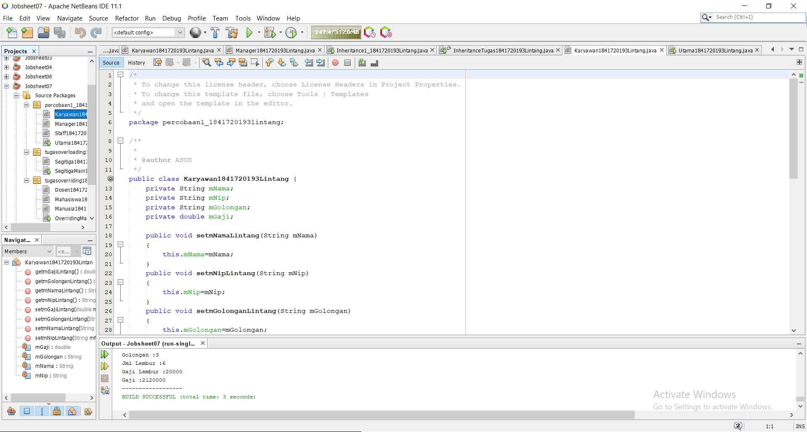
link kode program : [ini link ke kode program](../../src\7_Overriding_dan_Overloading\percobaan1_1841720193lintang\Karyawan1841720193Lintang.java)

2. Ketikkan kode class Staff dibawah ini. 
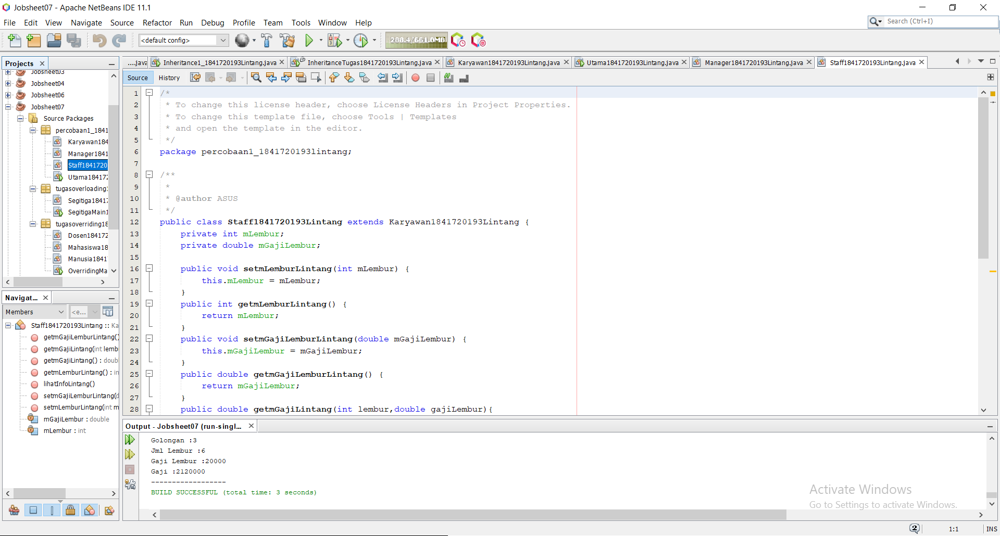
link kode program : [ini link ke kode program](../../src\7_Overriding_dan_Overloading\percobaan1_1841720193lintang\staff1841720193Lintang.java)

3. Ketikkan kode class Manager dibawah ini. 
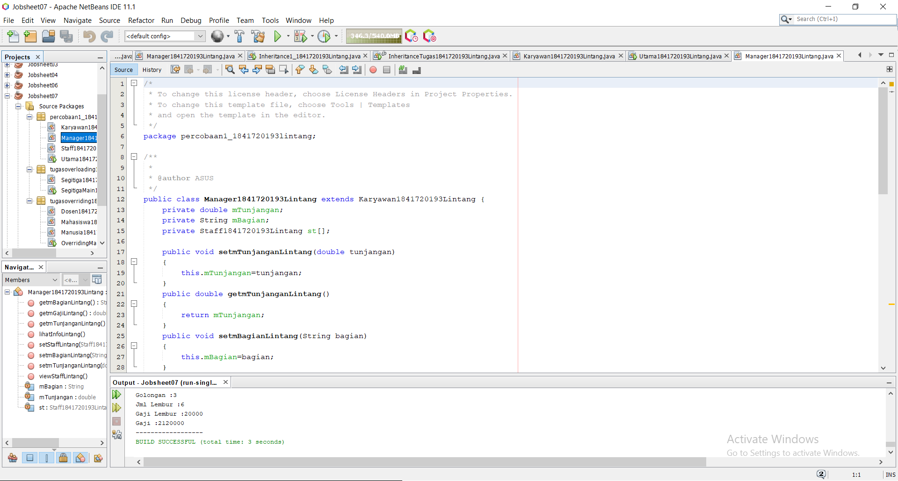
link kode program : [ini link ke kode program](../../src\7_Overriding_dan_Overloading\percobaan1_1841720193lintang\manager1841720193Lintang.java)

4. Ketikkan kode class Utama dibawah ini. 
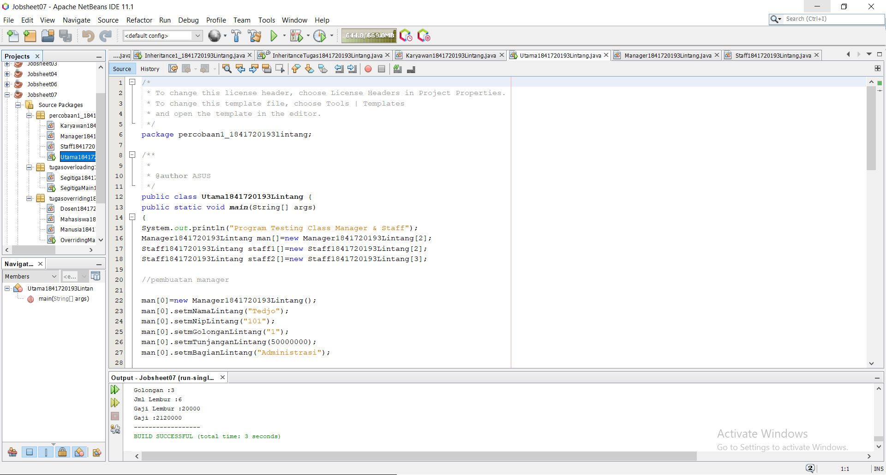
link kode program : [ini link ke kode program](../../src\7_Overriding_dan_Overloading\percobaan1_1841720193lintang\utama1841720193Lintang.java)

4. Ketikkan kode class Hasil1 dibawah ini. 
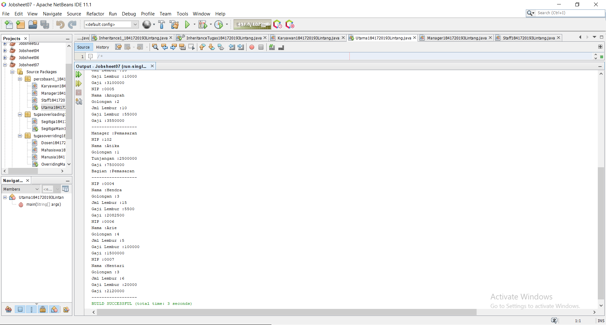

### Latihan 

4.1 Dari source coding diatas terletak dimanakah overloading? 
Jawab : void perkalian(int a, int b, int c){
    System.out.println(a*b*c);
}

4.2 Jika terdapat overloading ada berapa jumlah parameter yang berbeda?
Jawab : Ada 1 paramater yang berbeda yaitu “int c“
 
4.3 Dari source coding diatas terletak dimanakah overloading? 
Jawab : void perkalian(int a, int b){
    System.out.println(a*b);
}

4.4 Jika terdapat overloading ada berapa tipe parameter yang berbeda? 
Jawab : Ada 2, yaitu “double a” dan “double b”

4.5 Dari source coding diatas terletak dimanakah overriding? 
Jawab : class Ikan{
    public void swim(){
        System.out.println("Ikan bisa berenang");
    }
}

class Piranha extends Ikan{
    public void swim(){
        System.out.println("Piranha bisa makan daging");
    }
}

4.6 Jabarkanlah apabila sourcoding diatas jika terdapat overriding? 
Jawab : Deklarasi method pada subclass Piranha sama dengan method superclass Ikan

## Tugas

1. Overloading  
    A. Ketikkan kode class Segitiga dibawah ini. 
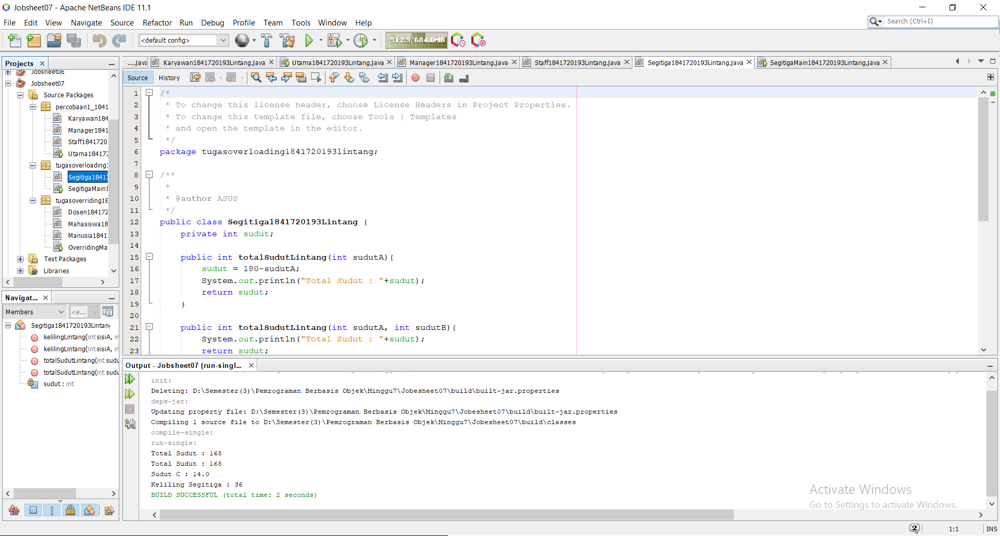
link kode program : [ini link ke kode program](../../src\7_Overriding_dan_Overloading\tugasoverloading1841720193lintang\Segitiga1841720193Lintang.java)

    B. Ketikkan kode class Segitiga Main dibawah ini. 
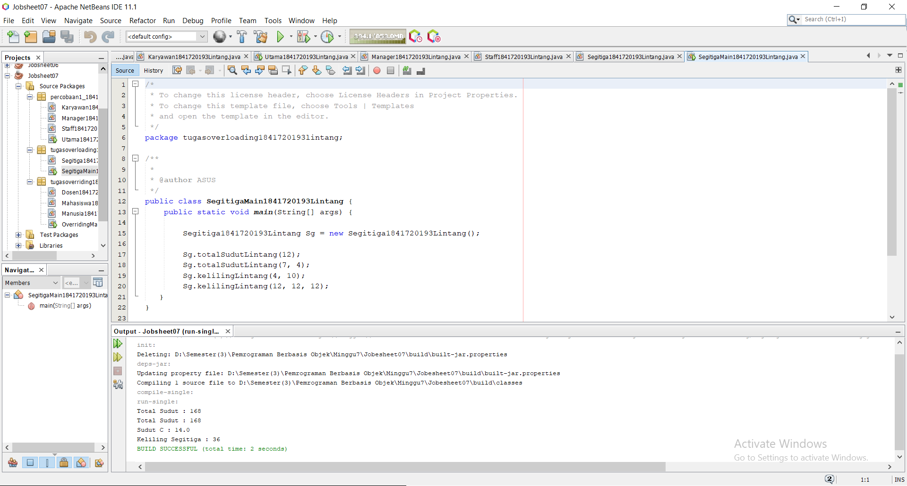
link kode program : [ini link ke kode program](../../src\7_Overriding_dan_Overloading\tugasoverloading1841720193lintang\SegitigaMain1841720193Lintang.java)

    C. Ketikkan kode class Hasil1 dibawah ini. 
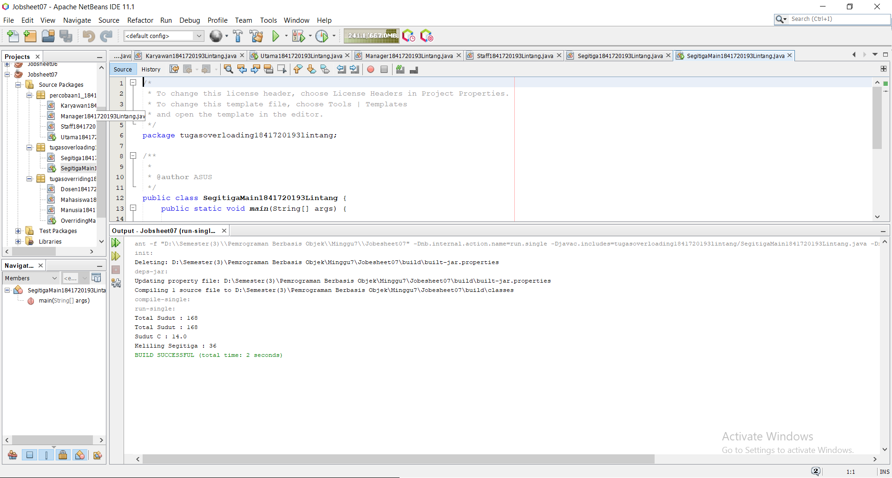

2. Overriding
    A. Ketikkan kode class Manusia dibawah ini. 
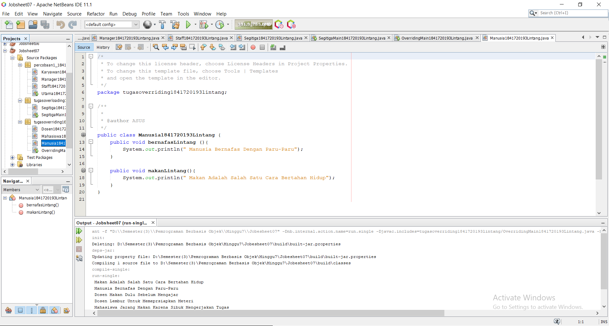
link kode program : [ini link ke kode program](../../src\7_Overriding_dan_Overloading\tugasoverriding1841720193lintang\Manusia1841720193Lintang.java)

    B. Ketikkan kode class Dosen dibawah ini. 
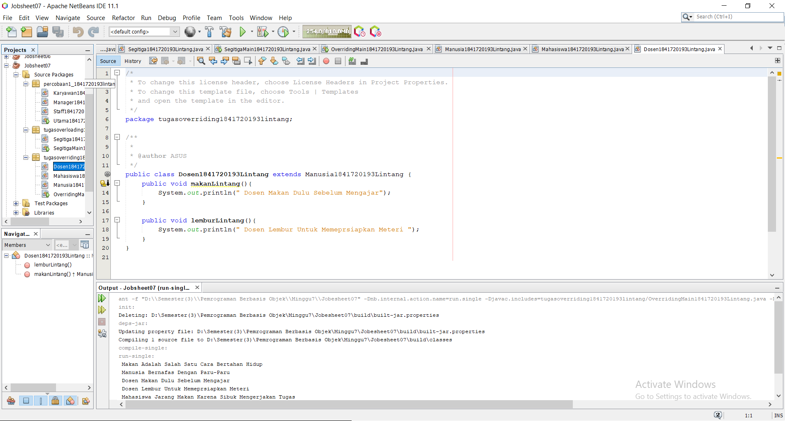
link kode program : [ini link ke kode program](../../src\7_Overriding_dan_Overloading\tugasoverriding1841720193lintang\Dosen1841720193Lintang.java)

    A. Ketikkan kode class Mahasiswa dibawah ini. 
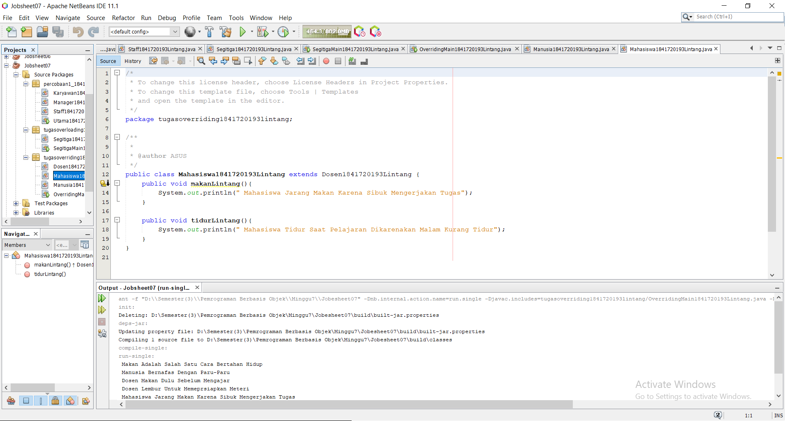
link kode program : [ini link ke kode program](../../src\7_Overriding_dan_Overloading\tugasoverriding1841720193lintang\Mahasiswa1841720193Lintang.java)

    B. Ketikkan kode class Overriding Main dibawah ini. 
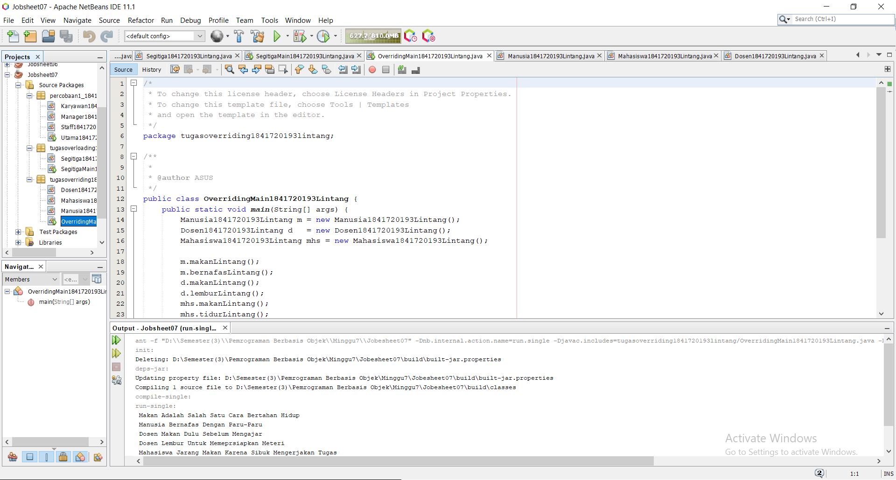
link kode program : [ini link ke kode program](../../src\7_Overriding_dan_Overloading\tugasoverriding1841720193lintang\OverridingMain1841720193Lintang.java)

    C. Ketikkan kode class Hasil1 dibawah ini. 
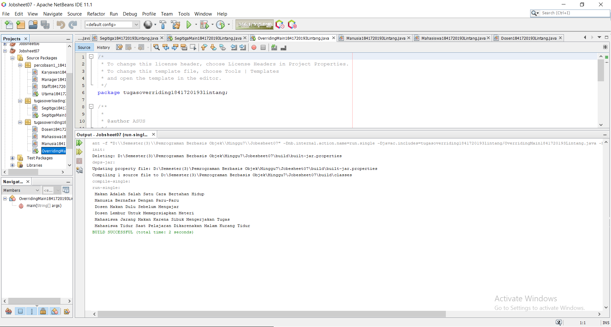

## Kesimpulan

Dari percobaan diatas, telah dipelajari kosep dari Overloading  adalah menuliskan kembali method dengan nama yang sama pada suatu class. Tujuannya dapat memudahkan penggunaan/pemanggilan method dengan fungsionalitas yang mirip, Overriding  adalah Sublass yang berusaha memodifkasi tingkah laku yang diwarisi dari superclass. Tujuannya subclass dapat memiliki tingkah laku yang lebih spesifik sehingga dapat dilakukan dengan cara mendeklarasikan kembali method milik parent class di subclass. 

## Pernyataan Diri

Saya menyatakan isi tugas, kode program, dan laporan praktikum ini dibuat oleh saya sendiri. Saya tidak melakukan plagiasi, kecurangan, menyalin/menggandakan milik orang lain.

Jika saya melakukan plagiasi, kecurangan, atau melanggar hak kekayaan intelektual, saya siap untuk mendapat sanksi atau hukuman sesuai peraturan perundang-undangan yang berlaku.

Ttd,

***(LINTANG KUSUMA ADJIE)***
