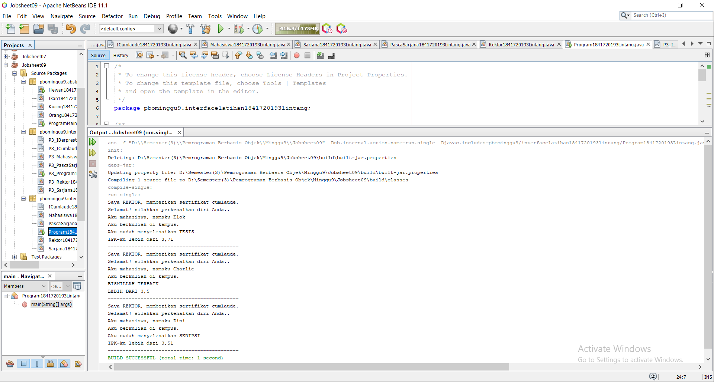

# Laporan Praktikum #9 -  9_Abstract Class dan Interface 

Abstract Class dan Interface

## Kompetensi
   
Setelah menyelesaikan lembar kerja ini mahasiswa diharapkan mampu: 
1.	Menjelaskan maksud dan tujuan penggunaan Abstract Class; 
2.	Menjelaskan maksud dan tujuan penggunaan Interface; 
3.	Menerapkan Abstract Class dan Interface di dalam pembuatan program. 

## Ringkasan Materi

1. Pendahuluan Abstract Class 
Abstract Class adalah class yang tidak dapat diinstansiasi namun dapat di-extend. Abstract class baru dapat dimanfaatkan ketika ia di-extend. 
 
Karakteristik: 
a.	Dapat memiliki properties dan methods seperti class biasa. 
b.	Selalu memiliki methods yang tidak memiliki tubuh (hanya deklarasinya saja), disebut juga abstract method. 
c.	Selalu dideklarasikan dengan menggunakan kata kunci abstract class. 
 
Kegunaan: 
Menggambarkan sesuatu yang bersifat umum, yang hanya bisa berfungsi setelah ia dideskripsikan ke dalam bentuk yang lebih spesifik. 
 
Interface 
Interface adalah struktur data yang hanya berisi abstract methods. Tidak ada apa-apa selain method abstract pada interface, termasuk atribut getter dan setter.  
 
Karakteristik: 
a.	Tidak ada apa-apa di dalamnya selain abstract methods. 
b.	Di konvensi bahasa pemrograman Java, namanya dianjurkan untuk selalu diawali dengan huruf kapital ‘I’. 
c.	Selalu dideklarasikan dengan menggunakan kata kunci interface. 
d.	Diimplementasikan dengan menggunakan kata kunci implements. 
 
Kegunaan: 
Bertindak seperti semacam kontrak/syarat yang HARUS dipenuhi bagi suatu class agar class tersebut dapat dianggap sebagai ‘sesuatu yang lain’.

## Praktikum

### Percobaan 1 Abstract Class 
   
1. Abstract Class 
Di dunia ini terdapat banyak jenis hewan. Semua hewan memiliki beberapa karakteristik yang sama, seperti contohnya semua hewan memiliki umur, hewan apapun itu, umurnya akan bertambah sama jumlahnya setiap tahun. 

Selain karakteristik yang sama, masing-masing hewan juga memiliki karakteristik yang berbeda satu dengan yang lainnya. Contohnya dalam hal bergerak. Cara kucing bergerak berbeda dengan cara ikan bergerak. Kucing bergerak dengan cara melangkahkan kaki-kakinya sedangkan ikan bergerak dengan cara menggerakkan siripnya. 
 
Setiap orang yang memelihara hewan dapat mengajak hewan peliharaannya berjalan (membuat agar hewan peliharaannya bergerak). Namun orang yang memelihara hewan yang berbeda, akan berbeda pula cara hewan peliharaannya dalam bergerak. 

1.	Buatlah sebuah project baru di NetBeans dengan nama PBOMinggu9 

2.	Pada package pbominggu9, tambahkan package baru dengan cara klik kanan nama package  New  Java Package… 
 
3.	Beri nama package tersebut dengan nama abstractclass. Semua class yang dibuat pada percobaan 1 ini diletakkan pada package yang sama, yaitu package abstractclass ini, 
 
4.	Pada package baru tersebut tambahkan class baru. 
 
5.	Beri nama class baru tersebut, yaitu class Hewan. 
 
6.	Pada class Hewan tersebut, ketikkan kode berikut ini. 
Class Hewan tersebut adalah class abstract berisi property dan method biasa, ditambah sebuah method abstract bernama bergerak(). Method tersebut didepannya terdapat kata kunci abstract dan tidak memiliki badan fungsi. Method ini nantinya akan di-override oleh class mana saja yang menjadi class turunan dari class Hewan tersebut. 
 
7.	Dengan cara yang sama, buatlah class dengan nama Kucing yang meng-extend class Hewan. Di dalam class Kucing tersebut, setelah Anda menuliskan kode seperti di bawah, maka akan muncul 
ikon lampu peringatan. Klik lampu tersebut dan kemudian pilih implement all abstract methods. 
  
8.	Maka akan secara otomatis dibuatkan fungsi yang meng-override fungsi abstract bergerak() yang ada pada class hewan. 
 
9.	Ubahlah badan fungsi tersebut dengan mengganti kode didalamnya menjadi seperti berikut. 
 
10.	Dengan cara yang sama seperti ketika Anda membuat class Kucing, buatlah class Hewan baru bernama Ikan dan buatlah kodenya seperti pada gambar dibawah. 
 
11.	Selanjutnya, buatlah class biasa baru yang bernama class Orang. Class ini adalah class yang menjadi pengguna dari class abstract Hewan yang sudah dibuat sebelumnya. Ketikkan pada class Orang tersebut, baris-baris kode seperti di bawah. 
 
12.	Terakhir, buatlah sebuah Main Class baru di dalam package yang sama. Beri nama class baru tersebut dengan nama class Program. Ketikkan didalamnya seperti kode di bawah ini. 
 
13.	Jalankan class tersebut dengan cara klik kanan pada class Program kemudian pilih Run File (Shift + F6). 

14. Perhatikan dan amati hasilnya!

1. Ketikkan kode class Hewan dibawah ini. 

link kode program : [ini link ke kode program](../../src\9_Abstract_Class_dan_Interface\pbominggu9\abstractclass1841720193lintang\hewan1841720193Lintang.java)

2. Ketikkan kode class Ikan dibawah ini. 

link kode program : [ini link ke kode program](../../src\9_Abstract_Class_dan_Interface\pbominggu9\abstractclass1841720193lintang\ikan1841720193Lintang.java)

3. Ketikkan kode class Kucing dibawah ini. 

link kode program : [ini link ke kode program](../../src\9_Abstract_Class_dan_Interface\pbominggu9\abstractclass1841720193lintang\kucing1841720193Lintang.java)

4. Ketikkan kode class Orang dibawah ini. 

link kode program : [ini link ke kode program](../../src\9_Abstract_Class_dan_Interface\pbominggu9\abstractclass1841720193lintang\orang1841720193Lintang.java)

5. Ketikkan kode class Main dibawah ini. 

link kode program : [ini link ke kode program](../../src\9_Abstract_Class_dan_Interface\pbominggu9\abstractclass1841720193lintang\programmain1841720193Lintang.java)

6. Ketikkan kode class Hasil1 dibawah ini. 

15. Pertanyaan diskusi: 
Bolehkah apabila sebuah class yang meng-extend suatu abstract class tidak mengimplementasikan method abstract yang ada di class induknya? Buktikan! 
Jawab : Tidak boleh , karena saat kita meng-extends suatu method berarti kita mewarisi sifat yang ada pada class yang kita extends. Bila kita tidak mengimplementasikan maka program tidak bisa di tampilkan seperti Hasil yang sudah saya SS di atas ini . artinya dengan mengimplementasikan kita berarti memanggil data atau isi yang ada pada kelas yang sudah kita extends.

### Percobaan 2 Interface 

Pada sebuah wisuda, seorang Rektor akan memberikan penghargaan sertifikat Cumlaude pada semua mahasiswa yang memenuhi persyaratan. Persyaratan agar seorang mahasiswa dapat disebut sebagai Cumlaude berbeda-beda antara mahasiswa Sarjana dan Pasca Sarjana. 
 
Untuk menjadi cumlaude, mahasiswa Sarjana harus mengerjakan skripsi dan memiliki IPK lebih tinggi dari 3,51. Sedangkan untuk mahasiswa Pasca Sarjana, mereka harus mengerjakan tesis dan meraih IPK lebih tinggi dari 3,71. 
Pada percobaan ini kita akan mencoba menerjemahkan skenario di atas ke dalam sebuah aplikasi sederhana yang memanfaatkan interface. 

1.	Pada project yang sama, buatlah sebuah package baru bernama interfacelatihan. 
 
2.	Pada package yang baru dibuat tersebut, tambahkan sebuah interface baru dengan cara klik kanan pada package  New  Java Interface… Beri nama interface baru tersebut dengan nama ICumlaude. 
 
3.	Pada interface ICumlaude tersebut, tambahkan 2 abstract methods bernama lulus() dan meraihIPKTinggi(). 

4.	Berikutnya, buatlah sebuah class baru bernama Mahasiswa dengan baris-baris kode seperti dibawah ini. 
 
5.	Selanjutnya, buatlah class baru bernama Sarjana yang merupakan turunan dari class 
Mahasiswa. Class Sarjana tersebut dibuat meng-implements interface ICumlaude yang sudah dibuat sebelumnya tadi. Ketikkan kode di bawah pada class tersebut. Tips: Anda dapat menggunakan fasilitas override otomatis dengan cara yang sama yaitu dengan mengklik ikon lampu peringatan seperti pada percobaan 1. 
 
6.	Selanjutnya sesuaikan isi dari method lulus() dan meraihIPKTinggi() agar sama dengan baris kode di bawah. 
Perhatikan pada baris kode di atas, class Sarjana meng-extend class Mahasiswa, ini berarti, Sarjana adalah Mahasiswa sementara itu agar semua objek dari class Sarjana ini nantinya dapat disebut sebagai Cumlaude maka ia harus meng-implements interface ICumlaude. 
 
7.	Kemudian dengan cara yang sama buatlah class baru bernama PascaSarjana dengan baris kode seperti di bawah ini. 
 
8.	Lalu buatlah sebuah class baru bernama Rektor. Class ini adalah class yang memanfaatkan classclass Mahasiswa yang telah dibuat sebelumnya. 
 
9.	Terakhir, buatlah sebuah class baru bernama Program yang diletakkan pada package yang sama dengan class-class percobaan 2. Tambahlan baris kode berikut ini: 
 
10.	Pada baris kode tersebut, apabila Anda mengetikkan semua class dengan benar, maka akan terdapat error dan class Program tidak dapat dieksekusi. Perbaikilah kode Anda agar program yang Anda buat mengeluarkan output seperti berikut ini: 

1. Ketikkan kode class ICumlaude dibawah ini. 

link kode program : [ini link ke kode program](../../src\9_Abstract_Class_dan_Interface\pbominggu9\interfacelatihan1841720193lintang\icumlaude1841720193Lintang.java)

2. Ketikkan kode class Mahasiswa dibawah ini. 

link kode program : [ini link ke kode program](../../src\9_Abstract_Class_dan_Interface\pbominggu9\interfacelatihan1841720193lintang\mahasiswa1841720193Lintang.java)

3. Ketikkan kode class Sarjana dibawah ini. 

link kode program : [ini link ke kode program](../../src\9_Abstract_Class_dan_Interface\pbominggu9\interfacelatihan1841720193lintang\sarjana1841720193Lintang.java)

4. Ketikkan kode class Pascasarjana dibawah ini. 

link kode program : [ini link ke kode program](../../src\9_Abstract_Class_dan_Interface\pbominggu9\interfacelatihan1841720193lintang\pascasarjana1841720193Lintang.java)

5. Ketikkan kode class Rektor dibawah ini. 

link kode program : [ini link ke kode program](../../src\9_Abstract_Class_dan_Interface\pbominggu9\interfacelatihan1841720193lintang\rektor1841720193Lintang.java)

6. Ketikkan kode class Program dibawah ini. 

link kode program : [ini link ke kode program](../../src\9_Abstract_Class_dan_Interface\pbominggu9\interfacelatihan1841720193lintang\program1841720193Lintang.java)

7. Ketikkan kode class Hasil2 dibawah ini. 

11.	Pertanyaan diskusi:  
a.	Mengapa pada langkah nomor 9 terjadi error? Jelaskan!
Jawab : Karena Class mahasiswaBiasa tidak di deklarasikan atau tidak di buat di dalam packge Interface. Sehingga saat di panggil terjadi error.

b.	Dapatkah method kuliahDiKampus() dipanggil dari objek sarjanaCumlaude di class Program? Mengapa demikian?
Jawab : Bisa , karena pada class Sarjana sudah di instansiasi menjadi object sajanaCumlaude di class Program. Dan class Sarjana sudah ter-extends dengan class Mahasiswa.

c.	Dapatkah method kuliahDiKampus() dipanggil dari parameter mahasiswa di method beriSertifikatCumlaude() pada class Rektor? Mengapa demikian? 
Jawab : Bisa jika suatu object memanggil method berSertifikatCumloude(). Dan terdapat parameter.

d.	Modifikasilah method beriSertifikatCumlaude() pada class Rektor agar hasil eksekusi class Program menjadi seperti berikut ini: 
Jawab : Yang dimodifikasi terdapat pada class sarjanaCumlode() dengan menambahkan atau memanggil method dari class supper yaitu (super.kuliahDiKampus), lalu memodifikasi di class PascaSarjana dengan menambahkan method dari class supper yaitu (super.kuliahDiKampus). dan memodifikasi pada beriSertifikatCumlaude() dengan menambahkan System.out.println("Selamat ! Bagaimana Anda bisa Cumlaude");.

### Percobaan 3 Multiple Interfaces Implementation 

Pada percobaan kali ini kita akan memodifikasi program yang telah dibuat pada Percobaan 2 sehingga pada program tersebut nantinya akan terdapat sebuah class yang meng-implements lebih dari 1 interface. 

Bayangkan pada skenario sebelumnya, dimana seorang rektor juga akan memberiSertifikatMawapres() pada sebuah acara wisuda. Mahasiswa yang berhak menerima penghargaan tersebut tentunya adalah mahasiswa yang berprestasi, dimana kriteria prestasi di sini berbeda antara mahasiswa Sarjana dengan mahasiswa Pasca Sarjana. Pada percobaan ini, kita akan menentukan kriteria prestasi yaitu: harus menjuaraiKompetisi() dan membuatPublikasiIlmiah().

1.	Pada package yang sama dengan package pada Percobaan 2, tambahkan sebuah interface baru yang bernama IBerprestasi. Tambahkan baris kode seperti berikut didalamnya. 
 
2.	Selanjutnya, modifikasilah class PascaSarjana dengan menambahkan interface baru IBerprestasi dibelakang kata kunci implements. Lalu dengan cara yang sama seperti sebelumnya, kliklah ikon lampu peringatan untuk meng-generate semua method abstract dari interface IBerprestasi pada class PascaSarjana. 
 
3.	Modifikasilah method yang telah di-generate oleh NetBeans menjadi seperti berikut. 
 
4.	Tambahkan method beriSertifikatMawapres() dengan baris kode seperti di bawah, pada class Rektor. 
 
5.	Terakhir, modifikasilah method main() pada class Program Anda. Comment-lah semua baris yang terdapat method beriSertifikatCumlaude(), lalu tambahkan baris kode baru seperti pada gambar di bawah ini. 
 
6.	Akan terdapat error pada langkah-5, sehingga program tidak dapat dieksekusi. Perbaikilah kode programmnya, sehingga hasil eksekusi menjad sama seperti pada screenshot di bawah ini. 

1. Ketikkan kode class IBerprestasi dibawah ini. 

link kode program : [ini link ke kode program](../../src\9_Abstract_Class_dan_Interface\pbominggu9\interfaceimplementation1841720193lintang\P3_IBerprestasi1841720193Lintang.java)

2. Ketikkan kode class icumlaude dibawah ini. 

link kode program : [ini link ke kode program](../../src\9_Abstract_Class_dan_Interface\pbominggu9\interfaceimplementation1841720193lintang\P3_ICumlaude1841720193Lintang.java)

3. Ketikkan kode class Mahasiswa dibawah ini. 

link kode program : [ini link ke kode program](../../src\9_Abstract_Class_dan_Interface\pbominggu9\interfaceimplementation1841720193lintang\P3_Mahasiswa1841720193Lintang.java)

4. Ketikkan kode class Sarjana dibawah ini. 

link kode program : [ini link ke kode program](../../src\9_Abstract_Class_dan_Interface\pbominggu9\interfaceimplementation1841720193lintang\P3_Sarjana1841720193Lintang.java)

5. Ketikkan kode class Pascasarjana dibawah ini. 

link kode program : [ini link ke kode program](../../src\9_Abstract_Class_dan_Interface\pbominggu9\interfaceimplementation1841720193lintang\P3_PascaSarjana1841720193Lintang.java)

6. Ketikkan kode class Rektor dibawah ini. 

link kode program : [ini link ke kode program](../../src\9_Abstract_Class_dan_Interface\pbominggu9\interfaceimplementation1841720193lintang\P3_Rektor1841720193Lintang.java)

7. Ketikkan kode class Program dibawah ini. 

link kode program : [ini link ke kode program](../../src\9_Abstract_Class_dan_Interface\pbominggu9\interfaceimplementation1841720193lintang\P3_Program1841720193Lintang.java)

8. Ketikkan kode class Hasil3 dibawah ini. 

7.	Pertanyaan diskusi: 
Apabila Sarjana Berprestasi harus menjuarai kompetisi NASIONAL dan menerbitkan artikel di jurnal NASIONAL, maka modifikasilah class-class yang terkait pada aplikasi Anda agar di class Program objek pakRektor dapat memberikan sertifikat mawapres pada objek sarjanaCumlaude. 
Jawab : Jadi saya memodifikasi di class Sarjana , dimana pada class sarjana tidak di deklarasikan.

## Kesimpulan

Dari percobaan diatas, telah dipelajari kosep dari Abstract Class dan Interface Menjelaskan maksud dan tujuan penggunaan Abstract Class, Menjelaskan maksud dan tujuan penggunaan Interface, Menerapkan Abstract Class dan Interface di dalam pembuatan program. 

## Pernyataan Diri

Saya menyatakan isi tugas, kode program, dan laporan praktikum ini dibuat oleh saya sendiri. Saya tidak melakukan plagiasi, kecurangan, menyalin/menggandakan milik orang lain.

Jika saya melakukan plagiasi, kecurangan, atau melanggar hak kekayaan intelektual, saya siap untuk mendapat sanksi atau hukuman sesuai peraturan perundang-undangan yang berlaku.

Ttd,

***(LINTANG KUSUMA ADJIE)***
